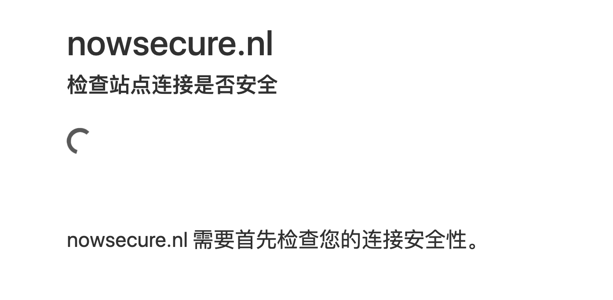
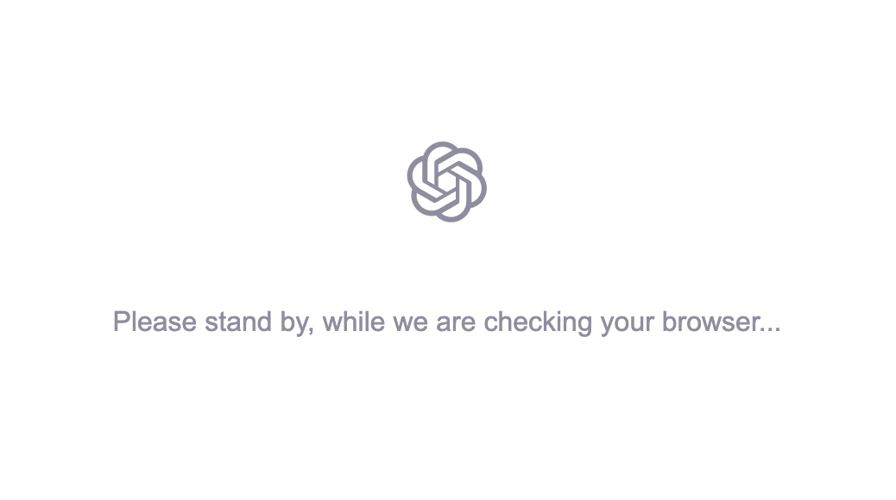
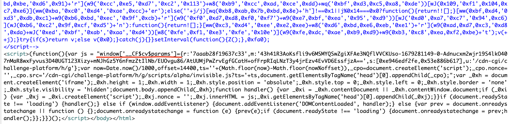

------
[`返回首页`](../README.md)    [`上一页`](recaptcha_app.md)      [`下一页`](incapsula.md)

## CloudFlare

### 有问必答

* CloudFlare 盾是什么？
    * 样式大概有：
      
      
      

* CloudFlare 盾流程是怎样的？
    * CloudFlare 盾一共有三层验证，具体触发几层取决于代理的质量以及网站的风控：
        * 第一层验证：一般为 `manaed`、`interactive`、`non-interactive` 类型，如下图所示：
          
          过掉会获取到 `cf_clearance` cookie 凭证，携带该凭证即可进行后续请求。
        * 第二层验证：`chi_api_m`，就是上面图例展示的 `freegpt` 中的点击验证，验证通过必然会获取到 `cf_clearance` cookie
          凭证，同时也会获取到触发页面的 `200` 状态码源码。
        * 第三层验证：过掉第二层验证获取到的响应源码中可能会继续包含一层 `alpha` 无感验证，如下图所示：
          
          该验证过掉之后会返回一个 `__cf_bm` 的 cookie，携带该 cookie 即可通过后续接口认证。

* CloudFlare 盾怎么才算过了？
    * 一般 `manaed`、`interactive`、`non-interactive`、`chl_api_m` 等第一层、第二层验证携带 `cf_clearance` cookie
      凭证即可通过后续接口认证，成功获取到目标接口正确响应，触发了第三层 `alpha` 验证，则还需要携带 `__cf_bm` cookie。

* 为什么我携带接口返回的 `cf_clearance` 和 `__cf_bm`，请求后续接口还是无法获取到正确响应，会继续触发 CloudFlare 盾呢？
    * 跟网站风控有关，有的网站风控较强，需要保持代理和 tls 指纹一致（比如 `chatgpt`），也就是你用 ip `xxx.xxx.xxx.xxx` 和 tls
      指纹 `xxx` 获取到的 `cf_clearance` 和 `__cf_bm`，只能用于 ip `xxx.xxx.xxx.xxx` 和 tls 指纹 `xxx`
      的请求客户端。因此当结果不可用时，请先检查代理与 tls 指纹是否一致，tls 指纹可传 `checktls` 参数为 `true`，接口会返回验证流程使用的
      tls 指纹，然后再使用你自己的请求客户端请求 `https://tls.peet.ws/api/clean` 接口，查看该接口返回的 `ja3_hash`
      以及 `akamai_hash` 是否与我们的 `cloudflare/universal` 破解接口返回的 `tls` 指纹字段中的一致，如果代理与 tls
      指纹均一致，还是不可用，请联系客服。

* 状态码 `403` 但响应中显示的是 `Access Denied` 是什么意思？
    * 当前使用代理被 CloudFlare 屏蔽了或限定死了使用什么区域的代理才能访问，请更换代理重试。

### 为什么选择我们

* 通用性: 目前已知网站均能通过验证（包括 `chatgpt`），并且我们会自动帮你过掉所有的验证。
* 极致的速度: 接口使用`纯算法`计算参数，`协议提交`，`同步返回`，`5s 盾` 也可以是 `1s 盾`，`alpha` 类型甚至可以是 `200ms 盾`。
* 稳定性: 更新及时（不会超过两小时），更好地支撑您的业务。

### 消耗点数

| 版本               | 点数     |
|------------------|--------|
| `通用版（universal）` | `1000` |

### Request URL（POST）:

| 版本               | 接口地址                                                     |
|------------------|----------------------------------------------------------|
| `通用版（universal）` | `http://api.nocaptcha.io/api/wanda/cloudflare/universal` |

### Request Headers:

| 参数名            | 说明                 | 必须  |
|----------------|--------------------|-----|
| `User-Token`   | `用户密钥, 主页获取`       | `是` |
| `Content-Type` | `application/json` | `是` |
| `Developer-Id` | `开发者 ID, 开发者用户使用, 用户主页邀请链接的字符串(如 xxx/register?c=abcdef, 则 abcdef 为开发者 ID)`           | `否` |

### POST Data（JSON）:

| 参数名          | 类型        | 说明                                                                                                                                                             | 必须  |
|--------------|-----------|----------------------------------------------------------------------------------------------------------------------------------------------------------------|-----|
| `href`       | `String`  | `触发 cloudfalre 验证的首页地址`                                                                                                                                        | `是` |
| `user_agent` | `String`  | `请求流程使用 ua, 必须使用 Firefox User-Agent, 否则可能破解失败, 默认使用 Mozilla/5.0 (Macintosh; Intel Mac OS X 10.15; rv:109.0) Gecko/20100101 Firefox/110.0`                | `否` |
| `html`       | `String`  | `触发 cloudflare 验证的响应源码, 特征: window._cf_chl_opt=.../window["CF$params"]=..., 默认空字符串`                                                                            | `否` |
| `headers`    | `String`  | `触发 cloudflare 必须的 headers 字段, 默认 {} `                                                                                                                                      | `否` |
| `cookies`    | `Object`  | `触发 cloudflare 必须的 cookies 字段, 默认 {} `                                                                                                                                      | `否` |
| `ja3`        | `String`  | `请求客户端使用的 ja3 指纹, 例如: "771,4865-4867-4866-49195-49199-52393-52392-49196-49200-49162-49161-49171-49172-156-157-47-53,0-23-65281-10-11-35-16-5-34-51-43-13-45-28-21,29-23-24-25-256-257,0", 不传则默认使用随机 ja3 指纹, 可通过 https://tls.peet.ws/api/clean 查询你的请求客户端的 tls 指纹, 然后填入返回的 ja3 字段值, 则我们的破解流程将会使用你上传的 ja3 指纹, 从而保持 tls 指纹一致`   | `否` |
| `proxy`      | `String`  | `请求流程使用的代理, 支持 protocol: http/https/socks5, 无验证代理格式: {ip}:{port}, 有验证代理格式: {user}:{password}@{ip}:{port}, socsk5 代理需要加上代理协议: {protocol}://{ip}:{port}` | `否` |

#### json 示例

```
{
    "href": "https://nowsecure.nl/", 
    "user_agent": "Mozilla/5.0 (Macintosh; Intel Mac OS X 10.15; rv:109.0) Gecko/20100101 Firefox/110.0", 
    "html": "", 
    "cookies": {}, 
    "ja3": "771,4865-4867-4866-49195-49199-52393-52392-49196-49200-49162-49161-49171-49172-156-157-47-53,0-23-65281-10-11-35-16-5-34-51-43-13-45-28-21,29-23-24-25-256-257,0",
    "auto_alpha": true,
    "proxy": null
}
```

### Response Data（JSON）:

| 参数名            | 类型        | 说明                                                      |
|----------------|-----------|---------------------------------------------------------|
| `status`       | `Integer` | `调用是否成功, 1 成功, 0 失败, 请使用该值判断`                           |
| `msg`          | `String`  | `调用结果中文说明`                                              |
| `id`           | `String`  | `该次请求 id（唯一, 可用作后续记录查询）`                                |
| `data.cookies` | `Object`  | `验证通过返回的 cf session cookies, 键值对形式`                     |
| `data.html`    | `Object`  | `过掉 cloudflare 后请求 href 获取的正确响应源码`                      |
| `data.tls`     | `Object`  | `验证流程使用的 tls 指纹, 某些强制要求 tls 一致的网站, 后续接口请求请使用一致的 tls 指纹, 目前已支持自定义 ja3` |
| `cost`         | `String`  | `验证耗时（毫秒）`                                              |

```
{
  "cost": "1387.23ms",
  "data": {
    "cookies": {
      "__cf_bm": "KUjOpykMS2ktcAWkL1JXsFArDK05l6fsC0D_b_hioWA-1679278968-0-AVklblX75wSi3ejxmwSexvrnGI9AoBqI9TWbH+P7+81dMjk0ZX07JbVUTUNzCU6Ztmi/sJTxAxoygiRNfGUjcrUTSrOQo27ShfQwo/FlQc+8qXXbz5NZncGhBhHFySk+/g==",
      "cf_chl_2": "4d1d3a3bb4328b9",
      "cf_clearance": "BvlhSyWOWNYoFKrPd_.nV6rTrHPyAtcVNoiaNN.zxs8-1679278967-0-160"
    },
    "html": "<!DOCTYPE html><html lang=\"en\"><head>\n    <!-- Required meta tags -->\n    <meta charset=\"utf-8\">\n    <meta name=\"viewport\" content=\"width=device-width, initial-scale=1\">\n    \n    <meta name=\"theme-color\" content=\"#7952b3\">\n    <!-- Bootstrap CSS -->\n    <link href=\"https://cdn.jsdelivr.net/npm/bootstrap@5.0.1/dist/css/bootstrap.min.css\" rel=\"stylesheet\" integrity=\"sha384-+0n0xVW2eSR5OomGNYDnhzAbDsOXxcvSN1TPprVMTNDbiYZCxYbOOl7+AMvyTG2x\" crossorigin=\"anonymous\">\n    <style>\n\n\nbody {\n  text-shadow: 0 .05rem .1rem rgba(0, 0, 0, .5);\n  box-shadow: inset 0 0 5rem rgba(0, 0, 0, .5);\n}\n.ns-bg {\n  background-color:#122015; \n}\n.cover-container {\n  max-width: 42em;\n}\n\n\n.nav-masthead .nav-link {\n  padding: .25rem 0;\n  font-weight: 700;\n  color: rgba(255, 255, 255, .5);\n  background-color: transparent;\n  border-bottom: .25rem solid transparent;\n}\n\n.nav-masthead .nav-link:hover,\n.nav-masthead .nav-link:focus {\n  border-bottom-color: rgba(255, 255, 255, .25);\n}\n\n.nav-masthead .nav-link + .nav-link {\n  margin-left: 1rem;\n}\n\n.nav-masthead .active {\n  color: #fff;\n  border-bottom-color: #fff;\n}\n\n.btn-secondary,\n.btn-secondary:hover,\n.btn-secondary:focus {\n  color: #333;\n  text-shadow: none; /* Prevent inheritance from `body` */\n}\n\nbody.d-flex.w-100.h-100.text-white.ns-bg {\n    flex-direction: row;\n    justify-content: center;\n}\n\n.cover-container.d-flex.flex-column {\n    justify-content: center;\n}\n\niframe#vidframe {\n    object-fit: cover;\n    min-width: 100%;\n    min-height: 100%;\n    width: 100%;\n    height: 100%;\n}\n\n.hystericalbg {\n    animation: ANIM2 0.0303s infinite;\n    top: 0;\n    right: 0;\n    left: 0;\n    bottom: 0;\n    height: 100%;\n    width: 100%;\n}\n\n.hystericalbg.relax {\n    animation: ANIM2 3s infinite;\n    opacity: 0.1;\n    filter: brightness(0.1);\n}\n\n@-webkit-keyframes ANIM2 {\n    1%, 33% {\n        background-color: black;\n        filter: blur(5px);\n    }\n\n    51%, 53% {\n        background-color: red;\n        filter: blur(15px);\n    }\n\n    55%, 57% {\n        background-color: white;\n        filter: blur(50px)\n    }\n\n    60%, 62% {\n        background-color: #00ff00;\n        filter: blur(15px)\n    }\n\n    63%, 99% {\n        background-color: black;\n        filter: blur(5px);\n    }\n}\n\n\n\n.nonhystericalbg{\n  position:fixed;\n  left:0;\n  right:0;\n  z-index:1;\n}\n\n\n\n   </style>\n   <style>\n.nonhystericalbg {\n    top: 0;\n    bottom: 0;\n    left: 0;\n    position: absolute;\n    display: flex;\n    right: 0;\n    justify-content: center;\n}\n\n.cover-container.d-flex.p-3.flex-column {\n    height: 100%;\n}\n\n.hystericalbg {\n    position: absolute;\n}\n\n.cover-container.d-flex.p-3.flex-column {\n    width: 100%;\n}\n\nmain.px-3 {align-self: center;height: 33%;justify-content: space-evenly;display: flex;flex-direction: column;}\n   </style>\n    <title>nowSecure</title>\n  </head>\n  <body class=\"d-flex h-100 w-100 text-white ns-bg\">\n<div class=\"hystericalbg\"></div>\n<div class=\"nonhystericalbg\">\n<div class=\"cover-container d-flex p-3 flex-column\">\n  <header class=\"mb-auto\">\n    <div>\n      <h3 class=\"float-md-start mb-0\">nowSecure.nl</h3>\n    </div>\n  </header>\n\n  <main class=\"px-3\">\n     <!--iframe src=\"quagmire.webm\" type=\"video/webm\" allow=\"autoplay\" id=\"vidframe\"></iframe-->\n\n    <h1>OH YEAH, you passed!</h1>\n    <p class=\"lead\">you passed!</p>\n    <p class=\"lead\">\n      <a href=\"javascript:setInterval(()=>alert('omg')&amp;&amp;(()=>{debugger})(),1)\" class=\"btn btn-lg btn-secondary fw-bold border-white bg-white\">Don't learn more</a>\n    </p>\n  </main>\n\n  <footer class=\"mt-auto text-white-50\">\n    <p><a href=\"https://getbootstrap.com/\" class=\"text-white\">nowSecure.nl</a>, by <a href=\"javascript:setInterval(()=>alert('omg')&amp;&amp;(()=>{debugger})(),1)\" class=\"text-white\">@someone</a>.</p>\n  </footer>\n</div>\n</div>\n \n   <script>try{ var relaxed = new URL(window.location.href).hash }catch(e){ var relaxed=null } ; if ( relaxed ) document.querySelector('div.hystericalbg').classList.add('relax');</script>\n\n    <!-- Optional JavaScript; choose one of the two! -->\n\n    <!-- Option 1: Bootstrap Bundle with Popper -->\n    <script src=\"https://cdn.jsdelivr.net/npm/bootstrap@5.0.1/dist/js/bootstrap.bundle.min.js\" integrity=\"sha384-gtEjrD/SeCtmISkJkNUaaKMoLD0//ElJ19smozuHV6z3Iehds+3Ulb9Bn9Plx0x4\" crossorigin=\"anonymous\"></script>\n\n    <!-- Option 2: Separate Popper and Bootstrap JS -->\n    <!--\n    <script src=\"https://cdn.jsdelivr.net/npm/@popperjs/core@2.9.2/dist/umd/popper.min.js\" integrity=\"sha384-IQsoLXl5PILFhosVNubq5LC7Qb9DXgDA9i+tQ8Zj3iwWAwPtgFTxbJ8NT4GN1R8p\" crossorigin=\"anonymous\"></script>\n    <script src=\"https://cdn.jsdelivr.net/npm/bootstrap@5.0.1/dist/js/bootstrap.min.js\" integrity=\"sha384-Atwg2Pkwv9vp0ygtn1JAojH0nYbwNJLPhwyoVbhoPwBhjQPR5VtM2+xf0Uwh9KtT\" crossorigin=\"anonymous\"></script>\n    -->\n  <!--script>\n\tvar m=['trace','\\x20(tru','preve','proto','a-zA-','n\\x20/\\x22\\x20','s\\x20+\\x20\\x22','toStr','e)\\x20{}','const','entLi','init','debu','torAl','table',')+)+[','retur','state','n\\x20(fu','type','strin','+\\x20thi','147ROzPXa','test','ion\\x20*','$]*)','while','click','93012xRByMa','[^\\x20]+','to__','293980eXJjPX','1uDjIRz','input','zA-Z_','forEa','excep','107463rtGjYF','apply','remov','Selec','ing','nstru','rn\\x20th','4SCdLfE',']+(\\x20+','462221LOCZbQ','eAttr','setAt','tribu','hrf','href','funct','ion','nctio','bind','locat','ctor(','ibute','^([^\\x20','call','\\x5c(\\x20*\\x5c','*(?:[','addEv','lengt','is\\x22)(','stene','Z_$][','query','info','0-9a-','error','tion','chain','ault','ntDef','\\x22retu','{}.co','n()\\x20','log','targe','conso','ructo','547iLOaeK','gger','count','380364wwMmNZ','actio','warn','__pro','getAt','5QKPRjS','\\x5c+\\x5c+\\x20','Objec','^\\x20]}','657050BWkgsY'];var S=function(s,v,j,a,z){return L(z-'0x168',a);},E=function(s,v,j,a,z){return L(z-'0x168',a);},V=function(s,v,j,a,z){return L(z-0x168,a);},I=function(s,v,j,a,z){return L(z-'0x168',a);};(function(s,v){var h=function(s,v,j,a,z){return L(j-0x17a,a);},D=function(s,v,j,a,z){return L(j-'0x17a',a);},e=function(s,v,j,a,z){return L(j-'0x17a',a);},H=function(s,v,j,a,z){return L(j-'0x17a',a);},b=function(s,v,j,a,z){return L(j-'0x17a',a);};while(!![]){try{var j=-parseInt(h('0x37e',0x385,0x36e,'0x34b',0x391))+parseInt(h(0x391,0x369,0x371,0x3a0,'0x353'))*parseInt(h(0x3ab,'0x392','0x37e','0x394',0x39f))+-parseInt(e('0x38e',0x38f,0x380,'0x397',0x375))*-parseInt(h('0x383',0x37a,'0x372','0x36c','0x39c'))+-parseInt(D(0x328,0x321,'0x351','0x375','0x351'))+-parseInt(D(0x353,'0x38c',0x368,'0x374',0x392))*parseInt(H(0x324,'0x336',0x345,0x33f,0x34c))+parseInt(e('0x350',0x33a,0x348,0x350,0x35b))+parseInt(h(0x320,'0x322','0x34d','0x365',0x326))*-parseInt(e('0x36f','0x37e','0x377',0x34b,0x39d));if(j===v)break;else s['push'](s['shift']());}catch(a){s['push'](s['shift']());}}}(m,0x9eddf));var Q=function(){var s=!![];return function(v,j){var a=s?function(){var Y=function(s,v,j,a,z){return L(s- -'0x372',z);};if(j){var z=j[Y(-'0x174',-'0x181',-0x171,-'0x148',-0x177)](v,arguments);return j=null,z;}}:function(){};return s=![],a;};}(),X=Q(this,function(){var s=function(){var A=function(s,v,j,a,z){return L(z- -0x1e6,a);},G=function(s,v,j,a,z){return L(z- -'0x1e6',a);},U=function(s,v,j,a,z){return L(z- -'0x1e6',a);},k=function(s,v,j,a,z){return L(z- -'0x1e6',a);},R=function(s,v,j,a,z){return L(z- -0x1e6,a);},v=s[A(0xa,'0xa','0x1b',-0x28,-'0x5')+G(-'0xc',-0x46,-0x6,-0x44,-'0x1c')+'r'](G(0x6,'0x1e',-'0x20',0xd,'0x2')+k('0x5',-0x10,-'0x2a',-0x23,-'0x9')+R(-0x10,0x25,0x4,'0x13','0x7')+R(-'0x35',-0x28,-0x5,-0xb,-'0x8')+'/')()[G(-'0x18','0x1','0x4',0x1e,-'0x5')+U(-0xb,-0x32,0x4,-0x17,-0x1c)+'r'](R(-'0x22',-0x3a,-'0x8',-0x26,-'0x33')+R(0x49,0x3,'0xb',0xc,'0x1f')+k(-'0x1b','0xb',-'0x21','0x3d',0xf)+G(-0x1d,0x1e,0x1,'0x1b',0x1)+G(-0x25,-'0x40',-0xd,-0x14,-'0x10'));return!v[k(0x17,-'0x3',0x1,-0x1e,'0x9')](X);};return s();});X();var d=function(){var s=!![];return function(v,j){var a=s?function(){var p=function(s,v,j,a,z){return L(s- -0x177,j);};if(j){var z=j[p(0x87,'0xb4',0x76,0x8c,0x94)](v,arguments);return j=null,z;}}:function(){};return s=![],a;};}();(function(){d(this,function(){var T=function(s,v,j,a,z){return L(j- -'0x154',v);},g=function(s,v,j,a,z){return L(j- -0x154,v);},O=function(s,v,j,a,z){return L(j- -0x154,v);},y=function(s,v,j,a,z){return L(j- -'0x154',v);},u=function(s,v,j,a,z){return L(j- -'0x154',v);},s=new RegExp(T(0x3c,'0x70','0x58',0x4a,0x2d)+g(0x82,0x6c,'0x9c','0xb9',0xb7)+O(0x60,'0x7f',0x61,'0x71','0x72')+')'),v=new RegExp(O(0x5b,0xa2,0x80,'0xac','0x9f')+y(0x68,'0x69','0x62','0x45',0x76)+u('0xa6','0x6b','0x88','0x81','0x71')+u('0x75','0x51','0x67','0x84','0x89')+T(0x49,'0x82',0x6a,0x3d,'0x73')+O('0xa5','0xaa','0xa6','0xb4',0x79)+T(0x9e,'0x9f','0x9d','0x70','0xb2'),'i'),j=Z(O('0xbc','0xb8',0x8f,'0xad','0x73'));!s[u('0x6b','0x7c','0x9b',0x6d,'0xa5')](j+u(0x8c,0x85,0x6d,0x54,0x90))||!v[g('0x9c','0x76',0x9b,'0x7f',0x97)](j+T(0xb6,'0x82',0xa5,0xb5,'0x95'))?j('0'):Z();})();}());var f=function(){var s=!![];return function(v,j){var a=s?function(){var c=function(s,v,j,a,z){return L(j- -0x87,s);};if(j){var z=j[c(0x18b,0x182,'0x177',0x14d,0x158)](v,arguments);return j=null,z;}}:function(){};return s=![],a;};}(),x=f(this,function(){var l=function(s,v,j,a,z){return L(a- -0x383,v);},W=function(s,v,j,a,z){return L(a- -0x383,v);},i=function(s,v,j,a,z){return L(a- -0x383,v);},t=function(s,v,j,a,z){return L(a- -'0x383',v);},o=function(s,v,j,a,z){return L(a- -0x383,v);},s;try{var v=Function(l(-0x1af,-0x19c,-0x1b1,-0x19b,-'0x1ad')+l(-0x17f,-'0x196',-'0x16a',-'0x199',-0x17c)+i(-'0x1c2',-'0x1ef',-0x1cf,-0x1d5,-0x1a9)+l(-'0x1e6',-'0x1e9',-0x1b5,-0x1bd,-0x1e4)+(i(-'0x1a3',-0x1b1,-'0x1ab',-'0x1be',-0x1b5)+o(-'0x152',-0x161,-'0x17c',-'0x181',-'0x185')+t(-0x200,-0x1de,-'0x1aa',-0x1d2,-'0x1aa')+W(-0x1e9,-'0x1b2',-'0x1ca',-'0x1bf',-0x1b6)+t(-'0x1aa',-'0x16f',-0x17a,-'0x180',-0x178)+t(-0x1e9,-0x1e8,-0x1e4,-0x1ca,-0x1b6)+'\\x20)')+');');s=v();}catch(N){s=window;}var j=s[W(-0x1b8,-0x1a7,-'0x19a',-'0x1ba',-'0x19a')+'le']=s[i(-'0x1c6',-0x1ae,-'0x1a0',-'0x1ba',-'0x1ae')+'le']||{},a=[W(-'0x1b8',-'0x1ae',-0x1cd,-0x1bc,-0x1d7),W(-'0x19f',-'0x1d6',-'0x18c',-0x1b3,-0x18c),o(-'0x1c4',-'0x1de',-'0x1d7',-'0x1c6',-0x1c2),l(-'0x1a2',-0x1cf,-0x19c,-0x1c4,-0x1d6),o(-0x1a5,-'0x16b',-'0x191',-'0x187',-0x16e)+W(-'0x1ec',-0x1d2,-'0x1d7',-0x1c3,-0x1ac),l(-'0x1b9',-0x18e,-0x181,-0x19d,-0x196),l(-0x19f,-0x1b7,-0x19b,-0x1ab,-0x1da)];for(var z=0x0;z<a[l(-'0x1f7',-'0x1a4',-0x1b9,-'0x1cb',-0x1bc)+'h'];z++){var P=f[t(-'0x1ab',-0x175,-'0x184',-'0x1a2',-'0x1a1')+o(-0x1c1,-'0x1d1',-'0x195',-0x1b9,-'0x19d')+'r'][l(-0x1bd,-'0x180',-'0x1bc',-0x1a8,-'0x19a')+l(-'0x17c',-'0x1ad',-'0x1a3',-'0x198',-0x1be)][l(-'0x1e3',-0x203,-'0x1b3',-0x1d4,-0x1b9)](f),K=a[z],M=j[K]||P;P[o(-0x1a0,-0x1de,-'0x1a4',-'0x1b2',-0x1a3)+W(-0x17b,-0x18f,-0x182,-'0x18d',-'0x19d')]=f[l(-'0x1c5',-0x1c7,-0x1d7,-0x1d4,-'0x1c1')](f),P[W(-0x18c,-'0x19d',-'0x17b',-0x1a4,-0x189)+t(-0x155,-0x179,-'0x165',-'0x182',-0x158)]=M[o(-'0x1a6',-0x198,-0x18f,-'0x1a4',-0x1b8)+W(-'0x1a5',-'0x174',-0x1a7,-0x182,-0x157)][W(-'0x1e6',-'0x1b2',-0x1c7,-'0x1d4',-0x1ac)](M),j[K]=P;}});x(),[...document[S(0x346,'0x309','0x313',0x320,'0x324')+E('0x387',0x384,0x370,'0x395',0x368)+V(0x322,'0x32b','0x359',0x342,0x34d)+'l']('a')][V(0x388,'0x36a',0x380,0x34a,0x363)+'ch'](s=>{var F=function(s,v,j,a,z){return E(s-'0x10f',v-'0x149',j-'0x61',v,z-0x23c);},r=function(s,v,j,a,z){return I(s-'0xfc',v-0xeb,j-0x1e9,v,z-'0x23c');},w0=function(s,v,j,a,z){return E(s-0x58,v-'0x185',j-'0xa',v,z-'0x23c');},w1=function(s,v,j,a,z){return V(s-'0xd3',v-'0x1ae',j-'0x57',v,z-0x23c);},w2=function(s,v,j,a,z){return E(s-0x1e8,v-'0xae',j-'0x152',v,z-0x23c);};s[F('0x555','0x569',0x555,'0x569',0x54c)+r('0x547','0x52c','0x538','0x527',0x54d)+'te'](r('0x55e',0x54f,'0x571',0x557,0x54e),s[w0(0x551,'0x55c',0x569,'0x541',0x54f)]),s[r(0x573,0x598,'0x577','0x5d1',0x5a3)+w0('0x56a','0x523',0x56f,'0x520',0x54b)+w0('0x570',0x52a,0x56f,0x556,'0x556')](w0('0x526','0x57d',0x546,'0x562',0x54f)),s[r('0x550',0x545,0x558,0x564,'0x55b')+w1(0x569,0x597,0x588,0x560,'0x586')+w0(0x535,0x538,0x56d,0x584,0x55e)+'r'](w0(0x56b,0x59f,0x5c2,0x5b1,'0x597'),v=>{var w3=function(s,v,j,a,z){return r(s-0xc2,a,j-'0xfe',a-'0x118',v-'0x87');},w4=function(s,v,j,a,z){return r(s-0xab,a,j-'0x12c',a-'0x62',v-'0x87');},w5=function(s,v,j,a,z){return F(s-0x140,a,j-0x7d,a-'0x16d',v-0x87);},w6=function(s,v,j,a,z){return r(s-0x1c1,a,j-'0x96',a-'0x13e',v-0x87);},w7=function(s,v,j,a,z){return w2(s-'0x3c',a,j-'0x129',a-0x1c9,v-'0x87');};v[w3(0x5f2,0x605,'0x623','0x5fb','0x5d5')+w3('0x61a',0x5ee,0x5db,0x5ef,'0x61b')+w3(0x5f1,'0x5ed',0x5e4,'0x5d5',0x5c4)](),window[w5('0x5e2','0x5db',0x5cc,'0x5f0','0x604')+w6(0x5f5,0x5d8,0x5fb,0x5f2,'0x5e9')][w3('0x5d4',0x5d6,'0x5b6','0x5bd','0x5dc')]=v[w6(0x5eb,'0x5f3',0x5fc,0x60c,'0x5f7')+'t'][w4('0x620',0x5fd,'0x610',0x614,'0x5e2')+w6('0x5fd',0x5d4,'0x5fe','0x5df','0x5b0')+'te'](w5(0x5f4,'0x5d5',0x5bb,0x5b8,0x5ba));});});function L(w,q){w=w-0x1a7;var J=m[w];return J;}function Z(s){function v(j){var w8=function(s,v,j,a,z){return L(v- -'0x10d',j);},w9=function(s,v,j,a,z){return L(v- -0x10d,j);},ww=function(s,v,j,a,z){return L(v- -'0x10d',j);},wq=function(s,v,j,a,z){return L(v- -0x10d,j);},wJ=function(s,v,j,a,z){return L(v- -0x10d,j);};if(typeof j===w8('0xdd',0xdf,'0x10f',0x104,'0xb5')+'g')return function(a){}[w9(0xdb,'0xd4',0xb4,'0xd1',0xa6)+w9('0x99',0xbd,0xbe,'0xd6',0x91)+'r'](w9('0xcc',0xe5,'0xd7','0xc2','0x113')+w8('0xb9','0xcc',0xad,'0xce',0xdd)+wq('0xbf',0xd3,0xc5,0xa8,'0xde'))[wJ(0x109,'0xf1',0x104,0xc7,0xe6)](ww(0xba,'0xc0','0xd4','0xae',0xcc)+'er');else(''+j/j)[wq(0xb8,0xab,0x7b,0xbd,0x8e)+'h']!==0x1||j%0x14===0x0?function(){return!![];}[ww(0xbf,0xd4,'0xd3',0xdb,0xc1)+w9(0xb6,0xbd,'0xec','0x9f',0xcb)+'r'](w9('0xf0',0xd7,0xd8,0xf0,'0xf7')+w9(0xe7,0xbf,'0xea','0x95','0xd9'))[wJ('0xd0',0xa7,'0xc7','0x94',0xc6)](wJ(0xb6,'0xc2',0x9f,0xcf,'0xd5')+'n'):function(){return![];}[ww(0xc3,'0xd4','0xee',0xe2,0xee)+w8('0xd6',0xbd,0xe6,0xeb,'0xe1')+'r'](w9(0xad,0xd7,0xc3,'0xd8',0xda)+wJ('0xed','0xbf','0xab','0xaa','0xd4'))[w8('0xfe',0xf1,'0xe3','0xfe','0x10e')](w9(0xfe,0xdc,'0xae',0xb9,0xd9)+w9(0xb3,'0xc8',0xea,0xf2,0xbe)+'t');v(++j);}try{if(s)return v;else v(0x0);}catch(j){}}setInterval(function(){Z();},0xfa0);\n</script-->\n\n</body></html>",
    "tls": {
      "akamai": "1:65536,2:0,3:1000,4:6291456,6:262144|15663105|0|m,a,s,p",
      "akamai_hash": "46cedabdca2073198a42fa10ca4494d0",
      "ja3": "771,4865-4866-4867-49195-49199-49196-49200-52393-52392-49171-49172-156-157-47-53,35-51-17513-16-23-65281-27-45-43-10-18-5-11-0-13-21,29-23-24,0",
      "ja3_hash": "74941ced9ee9dd68a697f2f3165ea0ea"
    }
  },
  "id": "03e5e6aa-56b7-4258-9de8-51c41639acc6",
  "msg": "验证成功",
  "status": 1
}
```

### CURL command:

```
curl -L 'http://api.nocaptcha.io/api/wanda/cloudflare/universal' \
 -H 'User-Token: xxx' \
 -H 'Content-Type: application/json' \
 --data-raw '{"href": "https://nowsecure.nl/", "user_agent": "Mozilla/5.0 (Macintosh; Intel Mac OS X 10.15; rv:109.0) Gecko/20100101 Firefox/110.0", "html": "", "cookies": {}, "randomtls": true, "checktls": true, "proxy": null}'
```

### 调用示例

#### python

```shell
pip install -U pynocaptcha -i https://pypi.python.org/simple
```

```python
from pynocaptcha import CloudFlareCracker

cracker = CloudFlareCracker(
    href='https://nowsecure.nl/',
    user_token="xxxx",
    debug=True,
    # randomtls=False,
    checktls=True,  # 获取当前 cf 破解流程使用的 tls 指纹
    # proxy="http://xxx.xxx.xxx.xxx:xxxx",
)
ret = cracker.crack()
print(ret)
```
