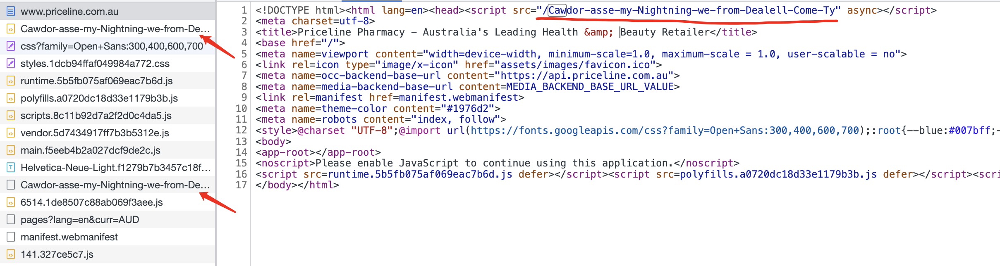
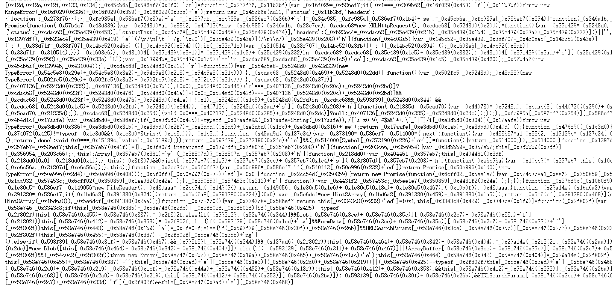

------
[`返回首页`](../README.md)    [`上一页`](cloudflare.md)       [`下一页`](incapsula1.md)

## Incapsula ( reese84 )

### 有问必答

* 接口中提交的 href 在哪里?(有多个 src 的情况下, 选择有 async 关键字的那个链接)
    * 
* href 返回样例(响应中会包含类似 ob 混淆一样的代码)
    * 

### 为什么选择我们

* 通用性: 目前已知网站均能通过验证。
* 极致的速度: 接口使用`纯算法`计算参数，`协议提交`，`同步返回`。
* 稳定性: 更新及时（不会超过两小时），更好地支撑您的业务。

### Request URL（POST）:

| 版本               | 接口地址                                                    |
|-------------------|---------------------------------------------------------|
| `reese84（universal）` | `http://api.nocaptcha.io/api/wanda/incapsula/reese84` |

### Request Headers:

| 参数名            | 说明                 | 必须  |
|----------------|--------------------|-----|
| `User-Token`   | `用户密钥, 主页获取`       | `是` |
| `Content-Type` | `application/json` | `是` |
| `Developer-Id` | `开发者 ID, 开发者用户使用, 用户主页邀请链接的字符串(如 xxx/register?c=abcdef, 则 abcdef 为开发者 ID)`           | `否` |

### POST Data（JSON）:

| 参数名          | 类型        | 说明                                                                                                                                                             | 必须  |
|--------------|-----------|----------------------------------------------------------------------------------------------------------------------------------------------------------------|-----|
| `href`       | `String`  | `触发 incapsula 验证的获取 incapsula js 的地址`                                                                                                                           | `是` |
| `user_agent` | `String`  | `请求流程使用 ua, 后续请求校验 ua 是否一致, 所以请传你后续请求将使用的 ua`                                                                                                      | `是` |
| `script`     | `String`  | `href 地址返回的 js 脚本`                                                                                                                                                | `是` |

#### json 示例

```
{
  "href": "https://www.priceline.com.au/Cawdor-asse-my-Nightning-we-from-Dealell-Come-Ty",
  "user_agent": "Mozilla/5.0 (Macintosh; Intel Mac OS X 10_15_7) AppleWebKit/537.36 (KHTML, like Gecko) Chrome/108.0.0.0 Safari/537.36"
}
```

### Response Data（JSON）:

#### 提交验证（submit=true）

| 参数名            | 类型        | 说明                            |
|----------------|-----------|-------------------------------|
| `status`       | `Integer` | `调用是否成功, 1 成功, 0 失败, 请使用该值判断` |
| `msg`          | `String`  | `调用结果中文说明`                    |
| `id`           | `String`  | `该次请求 id（唯一, 可用作后续记录查询）`      |
| `data.reese84` | `String`  | `验证通过返回的 reese84, 可用于后续接口`    |
| `cost`         | `String`  | `验证耗时（毫秒）`                    |

```
{
  "cost": "622.98ms",
  "data": {
    "reese84": "3:zZK9WE1WpiN2RiMbeQwybw==:jS26U8FF3P0pQJY5iMnUdbzfIJXHaIVeTpiezTLnEeHIqQy0Jf/Dl7KrfBxsO3i2lcf/KliKAIv6nLY9QsOH3dr/d7pfOWua95BI1H+XcqrICPdWWW9Pi1sd1C6uhXh+o2VIS2nwuEzcdlSKCsY26adyh9G7Fpy1imJrG5oJOvmaxiPfq7YDRY3Rk1pWufu5hY72ZSKpHE2o+mpsN/sXg2AXFLJzD/wybHc5Eu+EJMZifj7Uoo3l9IN9QnzqXkLp7/rky0Im4hR5OoOETZDkvpB664okvZZ70poyGr0dBJxKDmz6iLCGbujuYCRdOtS73bjJtj6xr/k3rYhtbgiNgiHx+7lYoDR/Do0EA6W521ZoE29sC7GNgLjKGmcS6kMtYKdE5SDZT+lwSe7F4R/hatyCczj/YE9GihQ6uTh2i1WkthP1gQnOdSCr5tE8l2P5xW9wwG9vxxV9DqndjvTAqxf5ry2z9+saCi5+7WWMWdwrCq6/kMRynCxNaijt3RJF:HevvS21PkHFdDDY1pp9cedihDzb0/e6ClAsDCb/gYsA="
  },
  "id": "c5b976bd-4c01-4378-bb44-324c76e9fe0f",
  "msg": "验证成功",
  "status": 1
}
```

#### 不提交验证, 仅计算（submit=false）

| 参数名      | 类型        | 说明                            |
|----------|-----------|-------------------------------|
| `status` | `Integer` | `调用是否成功, 1 成功, 0 失败, 请使用该值判断` |
| `msg`    | `String`  | `调用结果中文说明`                    |
| `id`     | `String`  | `该次请求 id（唯一, 可用作后续记录查询）`      |
| `data`   | `Object`  | `直接用作验证接口 post json 参数提交即可`   |
| `cost`   | `String`  | `验证耗时（毫秒）`                    |

```
{
  "cost": "279.66ms",
  "data": {
    "error": null,
    "old_token": null,
    "performance": {
      "interrogation": 319
    },
    "solution": {
      "interrogation": {
        "cr": 661732465,
        "og": 1,
        "p": "zIgxbeiIbZXZkbnJvdVNiImIsHWIbbDBiL3J1ZHRjdVNiImIsHWIbbDZiLmVvZGIyYiwdYhtsLWI4YW9UY3VQaGlvdG5iM2IsHWIbbDNiKGNkZWx1bmliJ2IsHWIbbDViJXNBcnRjdml0YW9pYi5iLB1iG2wkYg5vdG9yVGNhYitiLB1iG2wnYi9lb2xhY2l0bm9sIiIiLB1iG29jbm5jZWl0bm9sIiIiLB1iG2xwZ3VuaWIzYiwdYhtsLWItaVRlcHlzZWwiIiIsHWIbZHBWZmVpZXdFcmFubGJkZWwiIiIsHWIbZXdrYnRpZVRwbXJvcmFTeW90YXJlZ2wiIiIsHWIbZXdrYnRpZVBzcnNpZXR0bnRTcm9nYWIlYiwdYhtsKGIyYXdkcmFDZW5vdWNycm5leWNsIiIiLB1iG29ja29laW5FYmFlbGIkYiwdYhtsIWIwcG9DZWRhTmVtbCIiIiwdYhtwYU5wbWFiJWIsHWIbbCFiMHBlVnNyb2liLmIsHWIbbDBiIWxmdHJvYi1iLB1iG2wwYi9ydWR0Y2wiIiIsHWIbc3VyZWdBbmViNGIsHWIbbCxiLmF1Z2dhYiViLB1iG2wsYi5hdWdnYXNlbCIiIiwdYhtub2lMZW5sIiIiLB1iG2V3ZGJpcmV2YjJiLB1iG2wnYjRlYUdlbWFwc2RsIiIiLB1iG2FqYXZuRWJhZWxiJGIsHWIbbDNiLmVCZGFlb2NiLmIsHWIbbDZiImlhcmV0bCIiIiwdYhtsYmV1b3R0b2IoYiwdYhtsI2IpbGJwYW9kcmwiIiIsHWIbcmNkZW5laXRsYWIzYiwdYhtsK2I5ZW9icmFiJGIsHWIbbC1iLmFnYWRlbCIiIiwdYhtlbWlkRGF2ZWNpc2VsIiIiLB1iG3Rzcm9nYWIlYiwdYhtsM2IyZWl2ZWNvV2tycmVsIiIiLB1iG2l2dHJhdUtseWVvYnJhYiRiLB1iG2w3YithTGVjb2IrYiwdYhtsJGI2ZWNpTWVtZXJvYjliLB1iG2wpYitubCIiIiwdYhtpaGIkYiwdYhtsLGIjb3NrbCIiIiwdYhtlbWlkQ2FwYWJhbGl0aWVpYjNiLB1iG2wtYiRlYWllU3Nzb2liLmIsHWIbbDBiMmVpbXNzb2lzbmwiIiIsHWIbcnBzZW5lYXRpdG5vbCIiIiwdYhtlc2lybGFsIiIiLB1iG3N1YiJiLB1iG2w3Yi5pb2RDd25vcnRsb09zZXZscnlhbCIiIiwdYhtyeGwiIiIsHWIbc3VyZWdBbmVEdHRhYiFiLB1iG2wjYiVscmFwQUJwZGFlZ2wiIiIsHWIbZWdCdHRhZXR5cmwiIiIsHWIbZWdVdGVzTXJkZWFpbCIiIiwdYhtlcnVxc2VNdERJQUljY3NlYjNiLB1iG2wyYjFlZXV0c2VNaWRLYXlleVN0c21lY0FlY3NzbCIiIiwdYhtlc0F0cHBhQmdkYiViLB1iG2w3YiJlaWtHdHRlc1VyZWVNaWRiIWIsHWIbbCdiNGVuSXRzbGFlbFJkbGV0YWRlcEFzcGwiIiIsHWIbZXJpZ3RzcmVyUHRvY29sb2FIZG5lbGIyYiwdYhtsNWIybmdlc2lldFByb3JvdG9jSGxuYWxkcmVsIiIiHV1iLDYjdw1vC0xvdQtyT3dtfT06Ig1iOm9saWFsdS8wLiggIU1pY3Ruc297KElgNG5sZU1gI2FPYCATYBhwMTEfX3UpNwFgMHBlbGVXS2J0aXUvNzMzLiA2C2gUSExNYCwpbGVrR2AjZW9rYCkoQ29yZW1xLzgwMC4wLjAuE2AmYXJhbylzNS43NjMsIg9iNXlDck1zGXczd2I9IjooekNtIg5iLDptcnN3cXp0cg9MTXoiIjt2K3cOdBNiTXlrYnVpaypPeXlUdXQlRE93a309OiIhZnNsbCV5Yg11A0xNdSI9G3o6Yi0oTkNsIjpiIih9XWIsOWFqdXYTdhBzC1RPeGtydXoiKyIWU1BoczZ4aEt4elBiaWVmaHhHcGpkbHQlZHhzLHg5J2tNZ2sUeAlncXkRTWVYdWd6eWpXdDdzLVdLS1FJenIJUGVqbkNDdgh5YU1YQlp1JHg0NzU4eBBKdQV6dXZJSlJ2DnB0UHYoZG9sUENxJ1R5WGprd2t2T3NQSWpDV1NXeThaTFZwMy5LdHZFeUVEdTI3A2hyB0FiR3ZvaHhnWEhFaGsWZkJ5I3g1TWsPS0hPS1V1KndSVEpVYWJtT3FvbkVwImNERnkGVngrTXF6eQ5IdUpvY3NvU0tGY3cBSUlITG9MRXFpczILawFWRWRsdzkMbzVvcFNwb0pUbHU3M0tuU3EqREtJbU9jbwFneGtuSXl5a05GTHhldkV3VHErJmRTSXMjWnF4IW90YmZYdHJxRXMEVGlwdUNtWXkiUmV6dXNaSXAqazlyNxZ2ZmtPc2N5SkZsdyljenZvYXZpa3RPdnVsb0pCSkhSZFBhRUVocQ9XSW5OVHN6VE9Qc0lHWExkbnA2ZHgWb2t3J0x1Y2JCUVRucgFxK0JaUGRhYURlZ2s0ZkVlcXQoeQl0QUlSZVZvYlZMdGx5alFDencxMEpXSGp3bG14RGhPbHRzeGxGaXcTcC1zQktOanYUS3NzC3UNSVR3FUd2dVlxMzIreShEdRFydDpLQm9wJ2V4NGh1cAt3AVpwb1lXeBJ4EFlLT1RyVXVtRkxyRUdNTFlzbWh6WHQoS2tERm8YU1BSd2sPZGdjYj0iLDULTHZvJ2pxeWFydHUTdhBzL3czdwNMTndjfTN6Ig1iKwFiR1VMRXY2Enl2TENtdXEZZUZhQm9EWmpxTlpTd3VmZGNOZ2luRmsWUXlTUHELcm5vUXEpcWhoTHMjTXZnUHpXT3p3aHZlaXg3OnYoa05nWGdjVWsUcix2IlhQdUxYSlhCWEJZcCZBVWlMQnFxNgxxWVZrJHU0NCREd1prEHNyakhwOnJ1SXUPanU0Wmh0Dm9OeAd0ZXB2LXE5CnASeVd3WGx4cgJBcm9lZmFzSmlHR3V2EEppZWsnYmNvSVh2Nyh5ZkRBcXVzL2VZbUtXRGF6cXQOYkF1ZU5jZUltdUZ5FlFsS0RsS3Bub2xWZ28oaXJzNUlta1B6cg95eDFzJWl4NwF5amdOaHMnSng0OnIudiJRcm1nWEtzAnZKUXFmQVVpSk5yUXYKS1l2ayVPdDQ0RFB1OTMzb3pIWGZvb0l2JWpkbGJtdA5ZTnNLdlVwdhdxGVZ5KHlWd1h5VnUoQW9ZZWxpcElpSG11RHcDSWVrN2Jmc0Jhdjc4eW53D0R1ci9lanILakRhVHFacSRGdWZkY0dFaHZGbyxRUmsJUktybm9zKHNUaGpycyt0LWdQeG1PcW9ueWVnTXcnci1sTmluZ1RvczIyLnYiYm5wZ1hLbkJNZFdrJkFVaWdKc2p2C3YZRXVYeXQ2JERreTl2c29USFhmdlZJdTVqbVJZWHQNWU5sR3R6cHQHcStadjE5V3dYVGh2OAFvWWVlazBXaUdXdXdUUGhleTdiQmNOdHY0EnluckpCdXM0JWZrCFpEYXpxQkpSSXVmZGNWb29kRm8sUWZ5T28LckhvWWx2TmhpcnMmY2t1EHpHT05rc0tlaXg3FldxV05qcydMVXEscixhYmN6a3EYSXMCdnEWcGZDa2lzUm5zNgtLWW9yGnZ0NzkEbHk3Z3NvVEhrbm93SXYPamt4V3g0EHQOWnVua3B0LXEjaG8DeVVBWFpsdBhBcG9lcENyaWlGbXVEWE11JW8BYmNZTXA2NBJ5WEhJZXVyNCVDdVBxRFp6cU5wYXd1Y3kjeEVzYkZrLFFNawhWS3Fub3lCa2FoaWJzNhV1QlB5bU9yQXRxJWpNdypTclFOalhncUFxM3ItdiJjdnNIWEtIQk50YlFmRGtpcDRsc3YKS1lPZVV1NDQORHh4cTJzcXpIchBuawl3D2p3SmR5dBBZTnMrLGtwdQdxCFJ1OnlXd1huWnE0AXJZZUtXbXkpRUd1T0xQWGV5J2Jvb01KdjUoeUZESXJ1cQllREtPeARiVHFsWllyNWN5I2NNcGRGazERQ2FOa0twbm9qRm9taGdMcyFNdmNQeW1PcTQrWmVpc3chZW5JTmlzJ2svbyNyLnYiUmJ2eRhLcwJLRlpkZkRwKXIOaHF2DHFZc3ImSnQ3OQRSeGsmc3JESHA3Lm9JdQ9qeXEYeXQNdA52V251cHYXcTpkem55WHdYcU5rJ0FydCVZR254KUVtdXcmTXYlbxFiaXNDcnY2AnlCekh5dXEvZXJrC2NEWmpxcjUjQnVkeSNLY3JwRnkxEUx2EHcLcVhvc3hvcChnTHMub3FXUHlXT3pZc25laHg3MzlzcE5nbmdjc3UJci5hYmpQaElYS25CZ0JYU2ZDcClpSnBmdgx2GXIhY3E0Nw5EaHBrBXNxREh1cmtvSXclam1wYVZ0EFlOWWV0THB2B3EzGnhzOVVBWGdkd3UBcG9ldXlocSlIbXVjYkRpZWs3YnY3UHE2Nyh5TFBHcDVwL2VPZVBnRGFEcUVSWHI1ZnRja0FrcwZ5LFFqdgpRS3BIb21Gb1ZoZ0xzGkl0cxB3cg9uRXBpZWp4Nw9yNHMOaG5nd3d4BXIuYWJkSG9yGElzAmxSY3JmQmtpVlZ1R3YMYVlIR1hZdDcORHAOeWJzcXpIZm5yV0l2KypwDmN5NBBJTnMLdkdwdwdxC1J4eXlXUVhkcHkLQXF0JXMDcUdpR3I1UXcEeGV4AWJicAVyNjUoeVJUR3J1cjQlc09EZ0RhanFaRmJpdWV5I3ZBa3dGeQZRbmFLeUtxbm9leSx5aGpMczQnbHQQeFdPcllvWGVnY3cFdXBTTmdYZ2FwLzUyK3Yiaypwc1hLcwJzeRp0ZkFVaVpockd2DHYZbm1hbzQ0JERpSnUoc296SHgvL2NJdg9qSmxYZXQQdA5KQ2hKcHctcTIGeQV5V2dYaFZ3L0FxdCVodW9aaUdXdXlyRnBlbydiSndJWXY2OHlPVEtBdXMZZXJHRmdEWkRxTVpXaHVkeSN5RWl5RmsxEWFlSGhLcVhvQUZzdChqYnM0cCp2UHhyD0tBdWllak13JHlqbU5pWGdMc3hycitxYk9Qc0lYSXMCSXUiVGZCRWlvOTFpdgp2GVZhYXR0NiREeTU2OTNvVEh1KnBQSXcrKlRGWXM0DW9OZEd2enB0F3E5eTgLeVd3WEF5MyVBcm9lWnFrSmlIbXVyJlBLZWsBYk5wC3R2NhJ5TFRKZXVzL2VvOUVqRGFEcXkxJGV1ZU5jUmN2U0ZvLFF5dgVyS29zL0Z1J2toaHczOCNoblB5cg9ac2xvJWpNdzJrNnQOakhndSd5cHIsdiJNWHVxWExuQkh5E2lmRFVpaEJtcTYKYVlvE1lkdDUkRGd5OQRzb0RIcjZ2b0l1D2pxVmV6dBB0DnpDdnIwdRdxM3U5JXlXQVhseHQ3QW90JW5yMmdpRXI1dHcMQWVvN2JJUURKdjYCeUd2RkR1cxlleQdORkRhenFSZGJodWZkY2tJc1BGaxZRc2VFbEtySG93cTBMaGlMcwFwMlFQeldPZm9sc2VoY3cCaWhtTmduZ1hBczRyLWFiV2prelhMcwJLbFl3JkRraW9Ca3E2CWFZaHIlZ3Q3NERteTl1c3FqSGpEbHEJdSsqeQZhYXQNWU54dXBFcHQtcS8Gdyt5VWdYT3E1M0FxdCV5R29taUZHdUlzEEllbxFiellOczY1OHloRE50NXEZZUF1S0xEYkRxek5TRXVldGN3UWtBRm8sUU5HT0tLcUhvZkJyeShqcnMneDZWUHpHT0V4KmtlaU13Nwt0RE5pSGdYY3QQci1LYkxYbnVYSm5CT1pVdSZBVWlhTm5rNgxhWXM2EXF0Ng5EcHB3L3NxVEhHRG1zCXQPam85I3N0EElOcE9ndHB3LXElWnl3eVVRWG1oeA9Bb29leHFxSWlGV3V0blBvJXkRYmhwD3h2Njh5T25Lb3VwNCVGcUlWRGJEcWtGWWp1ZHRjamN1awZ5FlFlS0xFS3JzL3kaZ0FoaUxzNyNuSFB6R09NZ3VNZWlzdxlTcHJOaW5ndmt0EnItcWJVdyl4GEtzAm1xJERmQ3ApdFZwTHYLdhlWT1JxdDUOREVCeGxzcERIWnZncQl3JWpIaFNxdA9JTk9rMW1wdwdxB3ByMTlVd1h0TngzQXJJZUVxam1pSEd1cTMIdiV4J2JVUU5BdjQ4eUFySkN1cRllYU9MawRaVHFrKFp2NWV0Y3UBcngGeDERd2FQQUtyWG9BcG95KGdicyxvcmpQd3IPZ2NxTmVqeDcOYWplTmpIZ0hwMA5yLXYidiJ1ZVhMbkJaSmNxJkNFaXE4dVB2C0tZTHlXd3Q2DkRwAmsLc3FqSHYUb0pJdiVqUGhRd3QNdA5pU2dwcHUtcQtoczR5WFFYdXh5Z0FxWWVnQ3FtaUdtdVJER3YleTdiTEFLdTY2EnlxYkdyNXM0JVF1RWsEWURxSlpkRnVjeSN3dDFZRngWUUFpTnELb0hvYlZvc2hpdzM5b3JwUHhHT0N4Nk9laXN3EW1zbk5oWGdaZ2s5MithYk5idVhYS25CaWxWZWZEVWlUcShLdgxLWXZXZmF0Nw5EdSRvNTNyREhjcm9ZSXcrKnksUW80D0lOZ2l1R3B2MjEJUnUheVhnWGN0cTBBcG9lYWlteWlFV3VzckJ1JW8BYmdzSHU2Nzh5b3cNczVzGWVWS0R0BFp6cURsZW11ZXkjU0lrdUZrFlFTawJxS29zL3R0dVBoZ0xzFXd1WlB3R09ndDN6ZWdNdxRHdXcOalhnYUV4MTIrS2J4BHBUWEtYQm51JXRmQlVpQk50dnYJdhl4bWRKdDc0RGJseWZzckRIYXcqWkl2JWp5RlpTdBB0DnJ2MHRwdhdxF0J1E3lYQVh2Vnh1AXFJZWZDdUFpR3I1VmJQY2VvAWJCZ0ZpdjUSeWl9AWI9IiwzC1RPdQtic3oiJWI4RVVFelNkQlNQZ285K3ZuSnQBdHAGVnUyQmR3VXFydChxKk5OYUx1c1pYRU1qSlRVUW9YWER4cyt1VU5rOQNpd1NVdkFwNglYQlFNSXQYeHpNQkxHU2RScBRRYW9BUlJxLzlDdk5kcxBndnQ5BU1KaFJhQVJrLGJtaEhydgVwGXUzL3BGRlJjY1NWUXYwGHkrC3cqUmxxa0paR2s0BlFwMXIHZWR1Mnp0MThVUmNYcTdiTXUabmFDUXprdhNWdTEndiRRUHYCY0VYRVlkcSp4KXdOdhFZY3dPTFVBawhJb1pCS3pvaFR3CXF6TWpMRnpLSGt2J21WR0F5ZXRoZnUqYkFQT0hudCskRG1RQnIkeQJSTWspREtPS3Yud3RDcG9GZWJvN3pTcylxA3poTHlldHp1aFJZQUp0ImF5OFJTWmNGem1XbW8rUncOcmJ2CWJ4EUhjdRh4OmpXRHZvdCV0Q0xSWXJnTXEBaURvb1ZkQU54MVZ5WVFvLVR3JGRnSnZSUkRMVXZrRkNWUXJiRXFQY2pwOmxFQUJwLkZheXEUaVB5NgRWQngLdHBRVEpYRlp5eFJ1dC90VElSblhodklyBXBNdjgISlJSWHp3eldsdn0BYj0iLDljVHZyJXJzcC99M3oiLDgJYg14aypNc0lydHljTH03Yj00ejVybCVlYg91E3pNcAVMc3lrKnNnYipmeixhZXNiLDgLRHVxaypOd0tUc3ArenV2A3YQcjFyTW8tVHFyA3cOekVqdHoiNW5sbGIsN0tidXhDTE1vL2pvcwt3DndnfT06IjJ0ZXViLDdtYnVyB3JPaGsEdXoiNWIrbm9ubndsIitiM3IlenV3Z2pNciI9IjohTUljdG5sZWwiB2I1cQNUcW8lalB2I3YOeWI3IjoudW5rd29iLmIsMC16dHpxRHV3WX09OiIDYjJobW9gJURQYAZpVndlcmV6Oi9QdHJiYWVsRGAjb211bmVgNG9GbXJ0YXo6MGFscGNpdGFvaW8uZHB+ZmRwbCZldHR4cG8mZHB+ZmRDezJobW91aWAtRFBgBmlWd2VyZXo6L1B0cmJhZWxEYCNvbXVuZWA0b0ZtcnRhejowYWxwY2l0YW9pby5kcH5mZHBsJmV0dHhwbyZkcH5mZE17I2lvcm9zdGZFYCdkYCVEUGAGaVZ3ZXJlejovUHRyYmFlbERgI29tdW5lYDRvRm1ydGF6OjBhbHBjaXRhb2lvLmRwfmZkcGwmZXR0eHBvJmRwfmZkUHsGRFZgJWlld3oyUHoyb2F0bGJgJW9EdWNlbXRuRmAyb2FtejRhejBwaWxhY2l0bm9wbyZkcH5mZHRsOGVvNGRwfmZkcHsmZVdLYnRpYmApdXRsaW0gLkRQegZQejJvYXRsYmAlb0R1Y2VtdG5GYDJvYW16NGF6MHBpbGFjaXRub3BvJmRwfmZkdGw4ZW80ZHB+ZmRwYiZiLDdvcnR1C3Y2cxNyT3QPak56IiI7d0tydG5rMk1wIWp1bwlycHMLTE16Ii5iLWFkZXRJbWVsIgtiNHdrMk1uYXJ1cCIqYjo0aW1lbCIhYjR5Q3pQcAt2M3Urek11IjJiOiVycmZzZWIobD1DYjR1M3pzeGIMYjovLHATT3kwFHMSbGR4DWtZZ3UGV3hNelJmTkVScGREVnUFRk1HRkdQbw1uSXFJaU1wCkRjQ3kDTGxWbmN2EmlNeTAqUUtWSGR6bG1Xdg5yI3NJV0p5VkhkeW96Skd1MA9vI0RSQ1ZDTGxWbmN2EmlNeTAzDlhOcBB6bG5hd1JwEHJJWGZpSWxjcQFzGXIJVU5veHImcwFWTUdKak5OdHAUVFZITmwiD2INcisUc3JiMmI6A0FQd0F3E3dUaxpOeUtBVWsZV3ZXTHdYdUNwL3ERWGd3SFZjaXAPeBVKWXNlTmxCZ3QWSmsaZlVSenYBaERkc1BBc28SQVJOU1hseFNvGHNUd1Fnd3EpemhPTHUGdwVZeEp4AVZCTlJsRXkMd1RSRW1iaWZmawdWVU9Nc1BWaHgpQ1NwBVdnc1FLR05mdRB1EVh0QVVESnERWU9sU0FDVWdOYk54U1VKcTkCUWpEaVpReQFNa1FRQlZFRXNoSXgFRUdYdQdId0RvGEV4B2NQY3kBQ3hxDEdJd1ZuY2pvBEFGVlhZTlhwQVB5KGRmVHd0BkF4FUJVWXRocTE2d0VETmlVU1pHdwZBcQVtcGpBVk1wFVlsa0JLd05rKWdHbwpOcQtBTWdZUlVrWEtwEkxlTmxTUUV3V2lreURZcClWV1V0Uk5CQXk2UmhZd1VrRngwEVZjcTlCQ1V3TFlOQ1doSldvEUlsRFh1NnQxLmtSTHBqdxdyZXkaVXABTEZwCXkvJ1dMd0dZeAh3SFRscA9ac28WanQqQ05va0t0LyVQQnBBRG9Sd1Vqc0dBRkpRVk14aWsHc3hRZGhlT0J1BnAvFGxEZ3EDbwd3elVMdFZHSUVBSWswFEJsdCpCaxBRVFRFcRhQd3dIU0JGUFFBdldwd2tCSklTWm1VeQ1OcHd4NlJoWXdVa0Z4MAFXSnE1Q1J0LwVPTlJQaWhyLxNZRkZUcFNDQ1FUWGdaRkVBUVFJdng5eDkvR2sxTGdaVVVxIlBNZ0phQkVPTnNBVlVFQURZa0ROU2tmUWlCQkZ0ZG8ZandsQXkZQVdIcShDUng4TE9CQldQeEN4E2tFdQ5wQ3gYTWtZa2xFRHYuUUpIeRZCSnUWSHVEeRVUc0VRa1hBQXYBa1JXeBBWbG9qRUtBVlZZd09WZHBCRGNOZFJBZ2p1JW93VFZaaUNOVVFRVWxSWFNKR3gVSXIGanEDbxVQVFlncGlvJFBPaxZrcAJYdS1JdwRRWUVVa2JCcDhJaVZxFGN0N1JtRERFWUVrWWFrTVlRWmZ1A1pQTUt3bEJNSmdUUFpDQUJVQlBVWkJYWGhsdg9RbXI6b0F5KlhTVFJOcQN5MydFchFxBkxOVkpHUGVZchhqUXgEZ0NTWnETR3dBVW5BVUVXWUNaWVVrDXEJdnQIdQFZcQVsQXIBaFVOeFNBUFlkSnh4LwxxODA5FHAsRFRwQ0RWRUVYUnksdCd6dUNRUXpBZnRHSXMMUVRSa3IYaxhzdjkNVmsneCsTa2NEenQzElB4MnZPZHd5AXZabxpvQVd4BWRoSWh0dnMSeCNSWlplUmFwBXZSdlN3bmRBdxVvVEhBcEdHTEhSRkVJeXk2FWt1EEhSUEVrVE1XdCsLaXEpVFJ4DlhWWGl6V254R29vMkpqa3gxGXRiWHh4K3EyRWhZUHURcA5EbwpzQWRZclV5d0NqczlSVnpvElBTUWZOU3IGc2hBaFFtSGtNV3EvBHhVQlh4Skt0AktXWmxBcjcPWWRZd3YHanlHaUlQRWp0LzgMTmdIcBRpdylRdVZmUmZ2UEROQ2pBZFdoVkV3cAh5dzU0OnAhRVFXcHQnSFlyeTY3ZkNwEmRyAmsPd1VVb0VNcEhkTVJsVERld2RTbWdvMSFEQUlmem8Jb3BNRk91AVlzNAd4DEJrB3AveUNJd0JPb2xvF2tkQm8Ta0N3MzN6RlpJelR1K3AzEnM4QXZRV3QrSVNxKwNNRVB6a1JUSXNMQ3hDVHlMdVdyckF2MBRsWnMubxlaZ0J5OkpRT3p4B3AKVkJYcnQQchhETngnb3VJYVlxNkNuREZUQnpCYUVUR3crVUd2blJBeGNyMiFVQ0phVFFJSkVtYnNmdkNvQmtUWEF5Bmx0K3IHWEJMdHZMSWFzTXEkeDhZUll6QU10JE9kcQFGUEFkUHYNZ1BqRUdxNGpIcSdKZURrcwJZalJTeU1YZHcFQUNyDWN4czQ3AldTWEdicURjSmx3aFN2NydXa3QDeVpJV0pkRWNQdQ11cTl5ORR4b3hyDkFjSFVrT0ZvEHhRQ3EDSWprRG83TFdxJ3B1dhlwBVlqZGl2GVhidwV4E3EkY3lzNAxCRVNYa1FzTE95L3hXVHYidUhtcmlGeExtSm8Iclh4b3RFeXhORXZyeHINb2NNZGxBcDhiZEhhb0NWVlptQXZER3EZdTpFTWZrTVpwVHlNVGN3BWt4RWVGRXYGRXgYdW8XYldJUkFlTmxCemZSWGtRcAJkUWlHQXQ3WGdKeTc1UkJXcw1EektKY1dwK096SnMBQlJ4KxhUaFd5GkVseXkwOERxLwZQUEZscwx3DkpFTlZIdW9pQVdUUGFYRENYUVFjTnJNQ0NaYk1HbmZ2Q1lBeEhsVWZQZFJPeTZwJE96UUVyEkZOUEp5E3AVWU94C0ZPSmZreXdNSHpwJkVmcSsIdklZa0ZzNmZoSmhZanIqeSlIazZNS0xMek1vLXkDWlpUU2Fud1VtVXZGaERTRVlRZFJRWkFGU2h2RGp4FHcEVWdES3d1djdiQk1vbFFGdyNUbxhuakVSRlR2IklVTWlGVElSdk5BWEFHeCZNVHE0S0FLchhsUXkDdUNxMDpJc28MQ0dzbzlFbzpIYm5vFXEzckRIeSVRRklVd2pFUER3DU90ORN0bzlJaUNXVkZrFnADQ2JSZXlRQUVFaG9qazJ6ZXUFUXhGTnkXSkFQQUVQclJOSkR3eC9aU0p3UHVXdGp5dkdYVVVjeCFPaXEzd3JzZFV5UWxxEmxSWXp0EHIYRFB4EnNCVHYnaHABbzl6V2tTdnd3BFh0N2l3NzIvMDgEZ3EheDpHdghBWU1rR2FvD3g1IU1sQ0pFeE5HTVV2JElpV3BBZlpZSmRGVUpCSnQNancMSlBIeCdCRUl6UFFtRmsPa2xGQmt2VEZaRndGWXAST3BRUXQPcmJ1Ni8wMSdJcgFzakJZU1BpUHRUUXgveHhTVXdnU293BXg4RGhYbxh3D2RxKzEscSRHTFFUcCp4NE9UWlNCTkxmR3gBdFdndSlvGE1VQ25wUEVVc1BLZWtCchNUcnkleAZzJ0FtSk9qUFlTRGlaUlFReC91KFN2OnVTb2pFeXhEbFhvLkxQWnArMSx4eRBNUVZwKmt5F3pZUUJORGZrKUJpV2dwaXIUTVdDbnUvNlN2QUtldBJ5T1RQR2R4BUhyCXIKciZCSldZbFlTZ2Z4K29TVHAMZ1dqbyt1GUFESnBYZ1BzEUJ1MU1mTXZ4FHIya3kPWHURRFhETngoY05EaHgpczdUVkdneFBFa0hDSmZjbUVQSXd0N295RnkRVEp2NmVHc3pWTFVzAURac1RTZ3NlU0JjaUZ0LwZaZVBOWWxoZHg4VndaQ295RkNSdlpmWnZ1IURNQ2hZeQdseCh6d0RxMSt3REVrakNZZmNoRVB0J3UJcHhGeTgURkF2UkdzTGxhcHMORFpNakRSc1FTQnApRndvB1plUHRRWGhSeDhGUVpwMnIGQ2RQTWVZaXUhcyNSc1lrB2xwEnZNRHE6bHQmRXAQRVlnb2p3MXpndAZ3R0Z0a1RIdjl3WVBvRk1UUGhEcy9yB1dEbwtrcBJxNC5pUGlFTllvZ3R3dElNRXduREJMcG8HaUprA3NqdkdlRWZUZXkxNUNNSEZ1DVR0GFBRV3gwK0hWcDRKblFtciRVRURBSXgWUnNHU3VYQnkuZERSZEFnSHRZRXc2WENMdGZMRWZwDnp5WkJFd0REdwhwbwdpWk92AWdoR2VRbxRqeTp1Q2tIRlpOUXQYdzdVZnErSFZFZEtuUW1yJFFrcxlMbxZSRVdjS1VCeS5kalFyBHVIdFlrcgdYQkx0dmJKUXAOemdKT1VyN0R5DHBSWmVJU0VFb0JPaWtrEWtsVEJrdnlFbzNUeAtNVUd1K2pIUm5kS3cBakRqdQRGazJPYXpvKVNvKWR4EU14QXYvNUh0c2tvGEFpSXBzMlBadShHck1vF3h4K3EKRlJPVFl3dRBEZFB5M05WbHQCcjh3MDYka0NDUWdpSHQJRnkHalJMQUVyBWRGVExGRVJZS2NDT1h2TnQmTXlBcVB1Q3J2Z28YUVNhbHAyUFp1KHE1TXhXeGNVcDUFZE9Ud1FETUFmUHkBTkhsdAZyOGprcSVrQUNRb1NIV0pCeQdqeG8rBXIFZGxUdTkIUllLb1NkVXNOdCZ0E0VaUHNDbWZqQXpEelpvMydZWlJocTlWUVZ6Y0VxDmN0WXEwE0ROZnhGalpvCGt0MjIwZnI0JHgDdBNBREplcFZ5LW8odgRBU3gzN1J3KwNNSUxMa0xUSGhEUHRWU2FvOQtERURwJWt4WWdvUFVqdDh4CUZjWEtnaXcHQm8JU1ZpeHNYd1J3FUNPUHhyMwpNbXl3MAFGWG8BWlpwVEVVY09GQmxqSGs0KUF0aU5JTEhqTW8HdERQbFZEaHg3S0RwBHAhbnhZZ3AQYWV0N3gJRngJd2dsdwdxEE9hVXV4c3JBT2hWQ09QeHIxGk1reXc4J0JUeAVaWnUUcw9mQUZCZFRIcjQtQXRpdFFaSGlNbwN0dhJGbURjRHdPbXAScDQYaFBpa2ZKb3R3dApsUkhvSVNFeA12SWhkUHUSY2VvEmRrF1JsVG8Yd2p2KEpncCV2eE9PRWhyOTF4Mzh4B3gaTW1vNyprCXJvAlNBcChDZUVFUGN0D1lzImdFUFFUSnFvd1VoVm8xOGdOWlhBV3kBTnhGcStnRVRUTlJjZEFWbkpEdxRvVUdDcFB3BGpBSVlnbHM5KzNKWngGeBp4LUFZandJclB4YUNwKENlWWtJY3QBWXMiUXcKUVZKcXA3UmtWbzE4Z3kZcERUeQF0UlBlbGlFVERkSFFkQ1ZuWmpyNnJSR0NxNnpZalBJWWtrcjkzKEFoVUd4Kk5pSEJRUUlKY2xTSW5SeSVRREtxKndGZFlQRHZ3Ok9qY2ZHaHEScSxaUlB4WW1zEkV0RFlNdHc0WFFBbFVTWHhwFG8UdypDaUZDcCJzUVlvI1RDUVhncyN4MQVrdThJYXM1T1B3KlR0TGs4K29yE3FYQUxpekR2OkRxCkhreA9RSXRFcQlzR0J0OndQdCRUYnEmRlBZdEhhZENJaGNHaxRncDpRdTZ2DVBDWWJWbUZMSXV0IXdoeDk4OnkBdzkOVFlEZGhIeQx1AVRPZnZrFkF4EHEXQWlJZlR2SFFBeTcPSkJVcgVERE5wUVpldDV2CWJCT2FseVN4FUVCc28IRlpRUXgLc3AQaWxsSFJYUkt1GUR2J3QtbwlqY1pjTHlLbyl0dgJSVERod1FTbXACcCFIeFBlcBBhZXgRRHVGbwl3QWx3A3A2WlhVdkNOeAJBWlZlWEJWV28QSG1DZFZRenRucA9YY1ZHUXZnS2RjV0huSWlKdGl5CEJQeUpnYlB5L0ZGT2F0OQdwdxF3EEVWYWp3KxdocSZxNEp3T3B6ekdHd28XWU5TekhRZFFDWkNYZFlseRBncDp2GWl2DXcFWWhvbEhxTEJMTEF5Rk1reXQ0R3RHQ0FtTVNMUkVoTnpDdxB4DmlvVHYidylVcEFlSUNSUUZtZ09ZcS9peA5SUlpzUWVFSWtQU21OZk5yQVJ4TURxOlF0JkVzRGtPYmNteS9MQXYhQUJGUHUyLzcPUU9VSXEjaG50REJkVERhdnkFQklqQ2JuaFhrLk5XZWdrOXV0aFh3UUN4C05oVmhwZnZRRE5DZ0FkWWhWVHZzbnlEeS93Rld2U1VjTmtxLnMNS1pwLUJpUmpIYkxQSlZQaVNJSGV5InkpUVdNawZkWXZ2EHcxD2pwJlp5MBJxLEpSWWdiaXMSRU5HTmRRdlFMUUlqWmhZdjQXQUhjVXEob0N5VWdTV2pnUnkHZ3dvOTpxNzMreHQYbmhZT0FXZFBIUkFoTlZVaGNSSlZMdnIldxJFbWJjUWsFZ0d0QmRZQkF6cQt0OVZjRnl5bwRkUUNsQVhkQm10dWptenYvZUR3dylNaFVoazJ3D0xTWUJHdHQWRkJvElV0TGpjVW5kTXcZREZobnNDbXpvNmNyaU1EQU9hZ3h5BWsJT0p4cwdETGhCSEtSdUR3alBRZUZTRngwLHVzczlEeTNRdBd6UVF4MARJZkh4ClJ3bUJnQW1GWkRlWld2aWJxUGsrL3QSayF6c0NtZmpBekR6Wm8zJ1laUmhxNVVRVk5jQkRKbFNZSkJ3dRdFbwxraHkVZ3UHcjhYWHEoRWlDd2p6WnQnbUdxTGsCSXdoeGFzaEJiRFFJVkhtYmdqUE1oRWlRYkl3R3RnUEVzNxRVb2ZmR3gwN0RxNTNYdndXdwpFeFBiRlJ6UHQkUHYNQVZlQWp0VW9yBG9wUEVrREVZbXBtRVlMcktMeDlxF2tEdTRHdFBBZ1dNWEVSQWsNbENkZk1YZ3QwBlVIa1FBd3cJZ1pndzF1AWF0cypFS3B2SFNwdURJVUJRZU1STncwOHVzbnIFZHR6RlRIVU1mbFZJVk1CeDdUU3QrSXhzNXcCRVBUaVRRVWs4J2hpSldBQVBpdkJBYW9rSnBQdxladA95K3h3UHA4BkdOc3kPSnBTQldZZkhrAU5aQ1Z5dUNqeXlScRR2EUxWT2NGRHMuZk1BeHdGeCF4BkdBQXVaanZDY0lRUHkoRWlLchBjVnFibzYQcBZXam5kT3cjTUVxMHNZdHgyBVJGeUxiRmhFYXc5A1J0KwdRWXl0WEFyNiR0BHYSZ3lJdBlCeSsmd28rMxZDZkZ6S1BueRlLWVRNUXckRXknQlJlZnNOZW96QlVzKk9BWXJYb1pORnFGQll0AUd1C2h4WWxJT3IvMjRvEmNpRlp4andUemp2KwVqRkxFUVlaaFZHUnpoeQNkaHM4RVZxNjMnV28lRlltekF3F1FwOS9ET0NZUVR4CFlsWGlndldWUndFRVJnRHNBaHlEd2hES0lPdi1qQlFvZFNUZlZqdXAubncGUnpvFEh5WHUNZ3IZcmRxI2NUdThzenANUHVGem53VEF0N0lXeTERT3N3VmNBVXZTRUJPV2dyRHcjYnQvOCsUangWQkd4TVBYZGVEeSl0bzgjZ0dPSUZ4LncSRHYzd0NLTVRWYXh4eExRZ0F6c0R4JVl4cDUrDUVha0RlbzI0TVFFUVNodzVHRGtqQXNQaldCTXZNWHE4Nwp5LxFQUUZETmh3WFNsU0RPYlBFa1p4VmN4Q3AWWVh3J0JSQU1qUVJkcBRrLkxCbwNVaENVeQREeXZOV1lIa1FMSU9GZk14RHR3J019PSwiA2I1eWsqc21ZdxB4dXYzeWI9O3ohYjR5Q3pQdS92NHlLck11J0x1d2sqc2piMmI6JWdQdHJhbWF0ZXJlbCIzYjV5U2pNcytMcW8LanNyK3J1d0NEUHYPdjN5Yj00ejVyfWViLDYRYnNzL30zeiI5YhVlUGlWdTd5cDkmQk1tTUpzazRFVFhzFERCcXg0KVRabmJXTWZrQ3R1cmVsWVFjYnVVZlRwDXFNUnYob1ZmYWZQVHNIUmlqc2J5akx4KFVCb3pzI2JHYnFlS2JlalpGeWtSeQ9wNWJqZ3RiPSIsOWVyTXAzfTN6IgViNXMnVEh4RVJuZWlwc2xNaXVnRWJFV3lSTXIDVE54a3cNdDASR1JtdSx1BXY2ZEVydGNFanN3ZVRPdQVERWR2Em1lV3ctcmtyb1NZUkhSWUxNeGIMYiw5ZUxOdgN9M3oiKWI2CUhjakptYmhGR2V1d3AJaElqZGdJaWF1CVdZaHUpZW1GQ0lxMAVlTnEwDk1CchVxeDAhenQUU3l5KU91SkhJdU5XSWdZRExLZHATcRlqU0tSchVKdTpkQWRwIXZxBUtzFldMclp6Yklka1R2NAhJakluYmlGR1lpdRhJdTRwJmp0OmNqSWlOdglIY2pKbWJoRkdldXdXSWh0MSRnWWlSdglIY2pKbWJoRkdldXdzCWpJemNnWWIUYiw1JXpOdwlyTXoiB2Ivb2xnYCVuSW4jbCIvYjN2JWJPeWtEfTdiPSI6JUdrY2IvYiw1BXJ1by9ycXMHanN1J30NeiIyIjAwMDMwMSI3Iiw1K3JzdyVUc3drfT06IjdiBW5RcGtjeVh3L0tBWVNFckZJbEZDTXMGcQp5dDVNZXAxNUJCbxZzJ1N4EURkWUZDTWxTeDh2B1dYQkNUZWJ1NzNxF0ZyVEpwF0t4L3FhZWRiY3VGVGxCRHRqZ25PWnI3KwZCV0FFRFFvLktNdAh1OnITcBhjdghFd3EybzctbVpHZG8CdxV5MQV1ayp4SERvA2F5SHBydnN0U0R1NAZ1A3dxE1J0dS5hcjUNUWd6V3ZveDQ5bXUzCnNPckprKyVnZ2JIcldreTJIZkhFdQ1DTEFWQnh3c2VvS3IZdS8lcm51MCRHZUJCQ09aZ1F1TVdvZXZrTHpuVXkkeHFMZXJyKUdVTVFVR0p0ImxBbGNWemFTQWsrNC9BdEFwNXUUSHJwci84MSF4dm8KT3kxEkdPcAxOc3pzSXppcQJRSnkDdFFWQUxCUnR3TlBlQ3hjVlJMa3QwT2l1dDQSSngzVExlaWNhTGxlcitHZW9heApwS1J0elhyd0tmTEhpUHUtYXYxcHAXYncyIW8TdzI1IU1kSUt0elhIUmFvRm1uZ0tKdAR1SE5xY21QaXpFQ3NWQXkqS0FrV0p1InABV2lRZmt6QU9kbHlyMSs1CWs0KytHWWhzNDEURW8vcHQBYU5WaXcUcAVWZVJaeFd5Y1pUc1RHbwZjdQlXdXpDb3J2RmslWnkJb0JSZUVzcHIMR0lxCVhTdDpiZ3gvS21LV2V5dk5rSmhuYnRtUUdSbU11cTp5BmxrJnU1ZVRKcBJ5dnQ5cXUFQ3IPcHgzDXZEVUJqcHdrM3I3bmF4WmNqa1huYVRWdEdTT3I1OUNuUVJZeDN4MBNGYmsrMXU1KkVsd0VCZ3AxOnArUVlVdHlkS0lVQnA3VXMWTXpPTFl2cyt5KmtrJmZvVUtObmFUdWJpdWZraExPcFFISWF1JEtqdjMic3pvK0p3bkppTGdJYXlvd0JlSmZnUElnSmJFZGJjVW9icy8udUdxA1l0K0hCYnlhT3BTdSl3J3YmUWZFZUlBdW13GHYrJW93DmlnalJWY3hLQlZDQ0tQdDNCY3lidEdMdSdtcUp5AUZjSkp1NDMjR1JoVlpLRXc1K3FyYjIiLDclenR3CUx0eiIIYiFNVnk2bxp0BGdxa3NCdEFwbmF5IkJuWWZ5Z010BXE6RXQLamh5AVJKZ2s4DWZ0WmNhWGsUclZ1dhJabW9DU3ULSVlHbW9IQ2sXeVFCSGpyOGtCRkttdyp6RXVyDnlvRmRlVlFNZUt2cQRqRHBjbHlvcGREbm9hWWFzAU1VcCJKbmJWdjclYnZ3MTU1GkV2YUJqTXgTRnEBWEhtYWhGbHBkc2FwMHUVWUpSdnI4bzkabGZRd0daWVV1SFRhcDdkb1drCG1pSlRKZmpvOEJXaGRjaE5aTEZoTnYEdzY5LXJldHFDZnhrDnE4eXQ4dTY3EnRQQnIHeCJRYVhOdmRzAmtYdRhBcU5LUG1Cc2swFngXcQZTT3JDcARzCHkndBdyRXUiQ1p4cmVoeBdxMBJ0MjUseRlBUHYicgR6Qkh3UWV3YmsGaXM2I2sTVmdQWXh1BlZUYm8HRHloU2pvNE1tdSFNS05RVWRSQVVnazU0Ni9LUnFReVhvFnM5blBzWURadgxyZnN3JGN3dXAvDWdoeCVSR2R6WHAqT2FUa1RnaG14cEpieGd3E2NkUXB2FW8pTE1ZT2NydGNTR0dDawJtVnV3IkxWdVlDUmpTcgdFeXp0dAZWUGJHcXgMVnMjcS5qZGN0GmhndxFxb2x5dwZJdC14TVR0WFpZQU9zFlV4LGFjbncVeTIQYW8qVnJrRXd2BlZwFlNDbm8ocy56ZWRSbwJVTE1acTkGSlVScm55D3YTcCZHcnlxRHVYeVNsdEZFVk9jTGNhY0FLT3IyBW9tanUWeEVER2t0OURWdXQwbnQiUWVSUU1LUXAzRWhXRU9vZXNyVHgtYUR1C0ZaeVlBYnp2EEF3NmJTam5IcCV5OnMwNRVhYkh4cARPSG5OdBZ6cDkiZmJNWkt5GUN5VX0BYj0iLDMlak94U0xzcxl9M3oiIjtyJXcOcwdqdXUnfQ16IihiNHRzcGI6LD15Yg11A0xPdSsiT25NanNzIj0begFiKXJsYW5VY2lkb01lYhNiLClHbGxhU3NubCIIYixlZXZpdGFjZU5ldV1iIiw0LWpPcCtidXdHfT06IiI7diN3Dm8xYm92J1RPdRNic28HYnF3a309OiIsMS9iNHYHenVzKyp1a0dEUHUtdg1zGXJ0cCNMfTdiPTI6Iiw2I3JOcgtyTWlrOnRyL3Jzdgdqc3dlfT06Ih1bYiw5Q0ROd0t9PToiO1tzYiNyeiIoYjR0c3BvOjdvN3dnbi9sYWJzbHVvY3JzZWNuLW9QbzNhaXNuYW00dUJtNG0JYWhtJGhzdHVtbS05bHNlZWVwbTRmb3RtLWltJWhUdGFiLR19Yiw4CVRzd2V9PToiHVtsPW9iNHljenVyJVROdwtMTXMiPSI6ORFzdwdpZXENcQZ3VG5Sd3RFQm1YVFRwTXN3czV5YVBoTHEwMm5iUEVhazMCRk5lcRFzdldqVHINcQZwBFZMemhFQnlubWJyRnN3dw9zFE1sTHEzYmpUUEJhaxhoeWFkeRFzekduU3MJcQZwOnASd3RFQm1YRFRySnN3ek9pT09wTHErTFdiTU5hazpSV0xjdBFzakdyDXACcQZwFHpRemtFQnIIcyNxTnN3emVUVU1vTHEwMlVNUE5hazpCbllmeBFzdkdYZXIOcQZNRGpUeGhFQldueWNxTnN3ek9uVU5zTHEzTEhhT05hazZoWGNmeFFzUHIXTnIOcQZNVEZLemxFQnFIcyNxTnN3TGVqVFBoTHEFYnIOTU5haxBCbklldBFzdxdtWXECcQZzRHMaeGdFQnVIaVNySXN3cyswEk10THErTHpUT0JhaxBoeWNjeRFzem1uZXEKcQZ0FEhUd3RFQlNIelRySnN3cnVyDFBsTHE3TG1aTk1hazp4a1ZjcRFzdldzEHEFcQZ4BGlPeW9FQmlzBmRvQnN3ZmVYTU1nTHE3TFRNT0Fhay54WGNmeRFzczIGZHEBcQZ3RERNeGhFQm1IRFNvQnN3ZmVYTU1nTHE3TFRNT0JhazcCbWJmcBFzczIGZHEBcQZ3REROenBFQm1IbVhvRnN3cw9ETU1rTHE3YkRYTUZhazMCRE1jd1Fzekd6VnECcQZjVFhNd2dFQnlIVFlyQnN3Zk9uSU9sTH04LCILYjV1E2p1eWVUT3QrRHZ3CXY0cyNMcW8jdzR6ZWp9N2I9IjoOR0VLQnMsVXJ0K3FrZkVnUUVqdBd2MA9SSWZ2GW1YcHk3FWtkUHRyD1p3ekpEV2txOTB0MnBWb2J5YVNod3cwayRLTGd5B0dlSHlrVmZKcFdMbWsFcw9tbzMReXdJeUp1V3l5FWsldXVIbFhMQVlFeG82DFJ2JXMleHgCUXYyanQtZnVTeWthSnJEdFZYYktub0ZTcy8xLXYlanVCZHgwNHUYY1FDeRFvBEVieEtReHFyB3QEdnUyMTQ4MXIvNChZb3EwVEtRSGJUSXRJdA5SaFVFdwFEa3lLUXhldihRa1B4J1ZDeBFvekhSVkpTdxVDeTh0MSFpRGR0FmZ3Z3kNYmx4QUZUWng0MUhkTUtrLXVWckR6eThvLlNFcRdTRnB6dVNndRlxZHhacXNQREZrdm5vRVZmR01TYWp6cTB2MSdZcgF3R3dMdndrJHYDVWh3MBRTem5FZXRSawFrdFdrNWh1Fnd2GVhyLnp5C1pxLVF0U0RFVHMCdhhlQURrE2Nsbk1STHQOY2R4MS9XYlhsYWFwNjU1V3VlREVkT2ZwcwpyN3gwV2ZNU3QMUFlqY1lmbVJRay92QkNibyZRQ0pGVG50c1lod3VOVlJGaxB5SG1xIUJpcWVxdgNTcXIVSkh2MwtrMTIWVlR4NFNaa05WcjdxMjFXc1VGeER0cTd2MTB2cBBwZ2dRWHYvQnQYaxJDYXEveHgrbXNQTXgrMjMJZVdxCUpXaG9xTEFXbzR5dEtDeVpZSHprdmtRTG10ODgTeQtMQ3M0DnFReQViVUx5MApldEdvdHRMZGtwV1lCeHgjR29zNTJCWnVkT0Fjbk1rdwdla1hHYUhsdzBNdi93VnFybkdxdSJvL1l0Dk5jZHA0Z3VnQlh6dxJHUmhkZUV3A3Q1NDBkbHgpSVRsZVFBT3k0cGZHcHl6aFpacCxjZ3pxNmNFY2t1GWZycgtCQmlIS3FIeVBvcklVUlZkSlB4Q3gVa3ErQ3RUaw5RZ090Y1B0OXZaUmZ1UG50JmxvSE1XZ3QxREZ3dQxISHEMYkxjYkJPQ1VXSkdManI3cjIVdRVxBHRPV2tzZHY1Y3NJbWJJeBZndhlmcChjTmtRem1ERHN6awhLZUhlcQ13dAVzF09WYkx3MwJrCVZiWkFHWUxFdA5oZXIyN3Qta3NySnIlbXZPSHFZZXZPTWNVakpFWUhtZkdMcSpjdRByQnV4NDNZbwx5ZXIsVFlEQ3EEdHRqZG5FS3cZcTEidU9DazlvNiNxdExNV3JTVUhaUGlNREVqcVd3DlBCREdPdQZKQWtTZ1ZrZHF1WGV4ZURzawxyKk5rM1hVc213WWdKcEpwTnERS1FydyV2KnpxYmRGRXk4VmZOZmsXSWxWcRZGTEN6dHYxUHRwL3NwDk5WSlVveDUKRG9tWlFncnBvC2h5OVBzdApwVlBiRGV1V3l2S3l5eGl1cy5pS3M5LVRpWkNDZnp0A3YkVmtFeQ1ab0J0GG9mWkRyNTETUXh5MTM0FlBXeHIScjF2MkFyElJrMA54N2dWd0t2dBJOUHF4CGZxWm1sWm9UYWdOZngzT3JvBXM2Q2JHamtldBF1L28LTmd1bXhCcBFKdA1wDEVHdTQjciN3T3dqSFlVVmt2AWF2Jk94KwxJaGRWWld5cXkyNTBSRXp4eXAFR2V1GnQTYUVXemRKeDl4MxlJdDYxJXZLenMvJUV0UGpLUUFraxpyak5ScWVLby9RV1N4LlB6QUF4aGliV0lLdRRXcSRzdUdBZndhbkZ2AnRSTXFrIk1ab0h6RnYVcEpESllxKHY1TmhwanphcU1HZGNwVVRJcAxaZHloYnlQd0VkawhFdTYHRWt5V2FqdQxFc0t3SERMeQlDQlpEeXlMUXkSb3l3BHAVTHNCZ28zeUF1SUh6WEp1bHhqa0xhQUluUUFKVkVpQ0JqdhVQeDkySHJVemFyTGx1MxhmVkNQeVhKWE5kallaZ3cxUG1Qb3RadhVMdhRSaWhLSkZteldjVHExalhrLysORXN6UkJFWnA2TnAkZ2RlZndJawpXVEF1T2ZKYXdXbXQ3Y0RaZGtVVXpNVmRXUXM4YWhldW5BVWZKS28qT3YjUnl3NzIzUXgwZXBFZU5UTHQvcTMkVlJ6S3cyRUVFcwRKRWRvA0tTcTQNRURrdApvNllSbXISUWRreUluRHV0DnMFd3JHaUhxIWJzeVhUWExmdhJwdHgoVEhkU3lrNlJOVGdRQ2xTcCZjdxZWTVpOSXIwM0FYeldoWHR4LkZPRndRRWhsVEN0BEV2MWZvNDEIWXUCUVZrMTJ2dA11QVJ4MTcKZkxRSUFoQXVCT1B4Nk1uTGVsd0FQSHVTZm1SY0FYY2dxeDMkQ2N3GENBdkhGcC13REdyNS9NU1NCRXFHQll2dVlFU3Bxd2d3GXN0YXRjTnhCeC8RWWszLUNDdCsGemtRTkdqQkVVVVFPczY3FnIZYUxMR3hrM1lPQ1BabXNDcHBneXh1ZExYdgxUTmJvNTQxcHEqbVJwcXRJbW9Icgl1OGttWGlFcApzJU1uZEJacmNER21qZ0pBYlNndi5CZ0tjeTgxDUNSWVpSbzkuTGRFcw5MdVRucAtUbnNWU28tZ0V1InYBZGlEWmNMSnNSQUZiV3caU0ZoSWsDczpGdwp1WmpyMzB4dDhLTEtGaHV0GWhkdSlwIlBTeU1Zchd2a3BLcmV2JkdUUmZhc0puYUpIdUJSbylLT2J2dwJtbkJMRFVlckFLWW5CWWdOSVVyEEpOdDJMZ0dVV25wSm82eQZLcjV3LWlabVVNbyhsayZHdkpIS3FET3IxdzRvZEd3cDlTd3IQRENvCVpEcjkzZ3VtaU9HbXRSVG8OQW9tZnJHbzM4dS5zTk1CWm1mREVyZnV0Fkh2NG5wdkx1V3MHcTZIRGdvWlF2F0lKTlBzaXhzelJvDVZTVXlpbWd5TXcZdTIWaXpNeE9CZnkzOQRheSZoYU5yQ3UmeUtsWXcocSsGRHYoeXQrQ1lGVWVteEh3E3JvI3IKUlFveUxZbys3F1lkU09QbktVTlJ3ZmNtWGxWeW83EmV0VWVQZ0NuV2xWR1Buc0FIdHcXU0pTSXN4eGVvblJlWkNUaVlVcAVqdBpYd0JEeS1yF3c6Q2x4S2tjWHk5F1h3KlBSUnAXbnB2NW1LcSlMTXgCV25zUFV1LHAhaxBxNnFHd3VHWVl5MVJ1bzd5TGZyeTU4AnprZHIjQ0V2c2V5A0lkTVJ0SmZwMgF5BHMpcHgQRXcDbyFaanM3akd6UFNrEXBxYlNxay1xF3h5ODVSbVhScxdvNzBNcQdzZHEjWHI4B3J4TVZMcwR3BkdzM2FOc3NjSUpsb1JHdhRlbE9TczI6ZENOdAhrAmZFcSJwC2FMTnANQndkSkdlWnN0F3EvJUtzNw9xFWRqUUhJanNzOXZMdnRJbGdWV3pYU3BlT3IMY1ZPQ3NwB3FST1hzcyNxeRVaSGd3GVlkR3REeQ9vS1BNVXdPeHlVR1FoSEVwIlZqQ3MNdHp6d0ZITURCdXJHS0x2KXUBWnJBRnkUanEtcGNMUHdVaydqeHErdAphYk5jWmswJnIHRFh6VVNRa1hlRWN1cERSc1VrdBN5R1N4c2FGY2VvcVNUR1hBTFN1F3RFRHNxQWdodSwiMWI0eW96c3I3ck9zB2p0cyN3PTdiPSI6MA5Jb3BGc3Aod2lRYWsLdQN3bHFxN2FWeXV2MjR3FXp3dCdzGUd5EVZ1RmRGTUx0ZnhWcVRQSmRRanlRd1VmdTprVHkuRE5BTnULWmZ4LzA2WHhacUt5KxNCYm5hQWV3KndTTnBFR0VMRnA5c1dZRVRCS0p3WXZ4FkdJRnY2EWhrd2xVcUFNcHIMa1BPUUpwMQtPcTdEemtCRVRaZ1B9PSwiK2I1dSVqdXAHRE11LXJvbyNqT3YLem9vJXJ0dwl6dHciDGI6IXJzMhRFcwV3DXUJdzR5U1R1d2VqT3IZVE9yKXp0dC9oRnpHYkV1C2JFV0VocnRHdw55ZWJNemNqc3UrTFB1C2pzdhlSc1JZeHN5R1J1eEdxRlJ0FHJzJWpzcwd3DXUJdw52E0JPdgVSRXUhdzN5R2hydEdyRlJjVE12JWhOdQVSRXUhdzN5R2hydEdyRlJjVE16Y2pzcy1MT3ALVE9zL2hGekdiRXULYkVXRWhydEd3DnllYk16Y2pzcytydXIjck1XQWJFUk1yc1JrUnN1YWFFczA6dHYlRHN5UXcOcglUT3EJcnN5R0R0cy94dFJZeHN5R1J1eEdxRlJ0FHJzJXcOczFqTndLaEZ6R2JFdQtiRVdFaHJ0R3cOeWViTXpjanN3bXJ0dgVURVJRckZ6bWJzdUthRX00LCItYjR5U3JPdisqdWdrIk5tdXcNczVqc3AiPSI6J3gVeDgFdWJ4MTkzF3IqSHRJdBV3OBNvKGswFlVCdUxpQmVyVkxVdBN2eW1NeQdnZ0RrJmhIazQDQmVmdkhTZ2VLdDYlelpUdzQvTkl5LwxoVFFVeFdDeFRadCVYTHdvZ1h2A3lHRElBalNRT3djcmdBbnR3AkF5OnMyR28LVnQpTHlWbm8yNydLeHh4CE1KRXVseGJLZ1h2dilndzdjdDZEd3kYQ3lYeXlwVGsWSWxVQnBBekl1ck1GV3MacgFVUE1HTEhCUEV3dm9zeURzblN1V28nTEhZZEl2bnE1eWV4ORJJREhLTkVlYllkS3MFVFhHRG5BY0lRbHRFRG8vIlFORG84Q1BRZURjd3J0NGNRdypXakZ5GGZvR21pQVZjcTIiU2NVenATYmRweAtEUHV0Gk5Uc2ZIaElaRXl4ElpUeTAUSkxqdBRvMydEQ21JbxNKdTYxAW5kcjM4dQNIc2p5ZG5pQ3YFeHhPRERJRHAQbERNd0FrQUZxdydUVnY0JUxUQU5rBG8kVnk2azg2WFFxV1hlRWRkcBhPTHgMcWtUQnFNS0VteBBKV1lrc0tudFNzCVZEUUZpdRFsY0p0VXhlVlZ2RnAyZlZ0eGRCZm9xMARoalNzSHVxc3JxdwZ6U3k1eHF0Kxh3WHlzFkdkcHABQ2FxDHlBandydnhFbmtybwJGRnZBSGRQcBN5V3pveXN3bwRPcRl3T0xwAkd0IkF5UlF0AmV0LFdBSWZCcgxPRkdETngUY1JvKHh5QWsMQU9vJVB1KG9FZENoUVBqWWpzJUZ3BVpzMnNJdmdzU3c1byVnZ1RXUmlzNC85SWsrTXVrUGs0OE9NYUNtRXEqdwJFY29yF3YYQnV2MRZvA3Q0dWlrdDV5eXRFcWZ3dBpJcBpvE3RRdW85cWs2aXAZdDJjawZ5djcyZGNDTHJTWGhTWnE1dUF0b2dJaylRcjc2DGNxCmNFZXNWdjBMZ1NvFVNLdi9CUENRaHEWdhRzeANzeHhCdwdieQZLcGNMT25ranEHZ3l3akh3NxhGZkFTY1JFelVuWEZnbwdSYkZ0N3M0eHlWcEdGWGNMchFEQlRVcDdVc2dRdTAESHMLZU1XcDkvcSt2NXlHZ2hub2RFTHRxLU5MbU5GcBNYRHMPQ1pMYld4c2lzQ0xTR21JbxRzVUN5JWsQSUJxLw55VUVMazZlU3BtTkRma3dkYnV4BHNyUnMoeDgNRGZ1enkNWnNwE3hBQUlhS1ZocA9rEUNPbzM6RWZIVkRlVWZvLHc2LyxudHEuTFZGRngqekpMUU1CVmhLdkdpRmpUdEZKVnA4E3J4TlJWZUJrGUNVRmZuT0tzUlZ2Ind0PT0sIi9iNXM1VE50C0xxbwN6T3IxYk53IgxiOhFwdg1QY3hYeWVDWnghdXAvUGR6dWdvY2JaQ3A1b1pVeBlvF1hUdxdxSngqSGRhZ29DT0dyDnN0DnYldAFSR3ICeStYb1hzMGd1V2lRdngQb3ZiSHlkT3FrNHZ3TURNdis6Tm8QR3NKSmp2eWpSchJ2BXhVcjAHVUNKfQVsIiNiDnYLcnV4SXJ0cysqTnFrMk9rS2pzeUdMTXUiPRt6MSIMenkzCGx0NE12WEVNVVdMdGlRRGhyOUVWamIOYiwEcjMMbHk0SHZ0BU1UWFBzUlZQeHhQRFpRQn09LCIyIgxUeTMIbHQ0TXZYRXNUVlB4UlBQSnA5RE5pYg5iLCpyBEpreS82dnM9L2wiMiIKenkEdmtzLy92Yj0iLARzBEpreS82dnM9L11iIiwzJWpPchNyT3IldhBzJ3c1eWN3D3dTfT06IhBiL1R1WWFTUHUJYnVxJUpPcSFhcGJwBG1uSXJyUmFSc3Vvck91GWhOUkV4RVdjVEZSR2h1ZXViTm9hYW9hdVp2dhVMdHhldS14b3pvYnF5bW5FcnV1OVJFanIhSHRFUnVxcXBNa2tic3gHaHZ5NjFzdWtyc3INREVXb2JGUkdoRXMZUm5SdjBxdwdEbXUVYnV1LVJHaGd5c2FHeEZ0djF1eWtqRnYHaEV1GVJ1UkVSRVd2GnVlZ3c1bWlSR2t1enVaYVNHcQ1xclJhUnN1b3JPdRloTlJFeEVXY1RGUkdodWV1Ykp4ZWlvYnVabXUjYkticUpJc29ydXkwBEd2GUxyUmFSc3Vvck91GWh1UkVSRVdrYkZSR2huZXVyUGhvVHVZYVNQdQlidXElSkpxGXFwWnA6dXYndzV1MhRFcjAhcldLck92L1RFV2tiRlJHaEV1GVJuUnYwb3cwFEd2K0x1bXIUTnlpYnRYbVRtbVF2CnkxdQV5cCFyV0tyT3YvVEVXY1RGUkVoRXMZUm5SbXJxdxdEbW1HcXVieXJNcSVic1hzWkd2DXYwcXF1D3hrYm9jR3hydHASblJ2MG93L1N1dit3NXhxWktwY3FzYkV4cld2MXV5YVRNd1l4dVJFaEVXY2JGUkdobmV1ck1vbWJ0Wm1UR3UFYUticUJFenAhcldLck92L1RFV2tiRlJHaEV1GVJuUnYwdXchQ0d1EUtPYm11CnUVcm9hR3hGdHYxdXlrakZ2BWhFcxlSTlJFeEVXdhp1dQV3Cm11dS1obXc0WnN4bW93cXVpcipQdC9UdFlHaEZ0djF1eWtqRnYHaEV1GVJ1UkVSRVd2GnVlRXYPeSloSnUrcnN5F2psdBV3MG1taFBucVR1dy1EUHUZYnJSYVJzdW9yT3UZaHVSRVJFV2tiRlJHaG5ldXJiKGIsNSNMdHYlanVyGURPeWV2NnQ5dw5zL2p1dSd9DXoiGmIidhBzE2s4C0RlWU1rSm5xNFRBZEhrOm9NSnNRV2ZwJXgZQVZsdCRReTpTeAl2Z09rFG9UeGsTaUpRa2doVVpRZ2pnZ3BNczgqdjVycRl4NTJ3UXJRRm10dWZ3Y2sDcHA1cG8Md1R6YUVoWm5GWGskcVRHV0hQcCxScw5NdXMIRFVRU3FlRHcuZlR1ElR4MhZXWFhyOCZDZW8zNGFEWWV3Kw1vFUNvJHZ6R0htdFRJemFCWHU4Zm54NzFiZk5oTWsCdWNyNSpmbnpOSGJzNmsMcWZjVnN0K3FnemRNdmZzZWd2KHADZGlMd3NCTngNV3INQ0h5WklrbzZUbxNaSWF0cTlsdjkFT05Ra3VWVW85Nkh4OCl5LytUdkhPWnEDbxpPSnMtdxZ3dmp1MhFRWGp4DVdBdihrczUia1h0JXc1F3BtZE1IQkdLc3hLdQRTb3ZYaG13FHYwMXVwDkxWY1pqVFVvZlRjTEFUUG5zZXNOZml6RXAwLWZ1S2hmaFJOaWp6dQdycHdZdBZ3DXcNUkNTV2FMaXJvaHh2T2JmWU9rQWtDQnB2cW9id1Bzc0hycEdWUEZiZElPZnBoZGVJeTRmYnpzWkp2SklocTdjdQFaVmRRd1d3WXkibyFrWHArNwdXQk5Ed0FtdERMbXJtVWlRS09vdzRyOXgWVGJVdAR4BXFIWURuc3BkQkJGeW1VUG14E0FTU25rcSVwNktiTWsmbXISeHNlRXg2bW80D29YUWp0dyNBayI9IiwyMWJ0eW1ic3AHfQ16IjAiLwNwdkZrKnJVeDpXfTdiPSIsMCN3NHUrenV3S309OiIiYgV2czcjcmpyZ3ZZUXUGYgZiLDMlYk93E0xOeWt9M3oiEmI4JWI9PWI7eGVMTnoiIjt1L3JzeWN6dW8LcnFyLXc0eiIdW2IsMC1yTXhxanV5ZXYQeU9Mc3hjRHR6Ih1bbD1lYg9zE2pzci9Mc3MxTH03Yj07eiw9UWI1d2siTmtJTFB2MXYNcyVic3diImI6KXdleRFzSllDTW5YT2ZyJnEHc3BFczYLUVNjYXU3YXlTcWJ6RncIaEtyfQ1sIi1iNXMnVE92E1RzdQlidXlrFE5xT3c1d1N6TU=",
        "sr": 981077036,
        "st": 1679134739
      },
      "version": "beta"
    }
  },
  "id": "b41526e4-60b9-4005-8967-0124d328f386",
  "msg": "验证成功",
  "status": 1
}
```

### CURL command:

```
curl -L 'http://api.nocaptcha.io/api/wanda/incapsula/universal' \
 -H 'User-Token: xxx' \
 -H 'Content-Type: application/json' \
 --data-raw '{"href": "https://www.priceline.com.au/Cawdor-asse-my-Nightning-we-from-Dealell-Come-Ty", "user_agent": "Mozilla/5.0 (Macintosh; Intel Mac OS X 10_15_7) AppleWebKit/537.36 (KHTML, like Gecko) Chrome/108.0.0.0 Safari/537.36", "submit": true, "proxy": null}'
```

### 调用示例

#### python

```shell
pip install -U pynocaptcha -i https://pypi.python.org/simple
```

```python
from pynocaptcha import IncapsulaReee84Cracker

cracker = IncapsulaReee84Cracker(
    user_token="xxx",
    href="https://www.priceline.com.au/Cawdor-asse-my-Nightning-we-from-Dealell-Come-Ty",
    user_agent="Mozilla/5.0 (Macintosh; Intel Mac OS X 10_15_7) AppleWebKit/537.36 (KHTML, like Gecko) Chrome/108.0.0.0 Safari/537.36",
    debug=True,
    # submit=False,
    # check_useful=False,
)
ret = cracker.crack()
print(ret)
```
