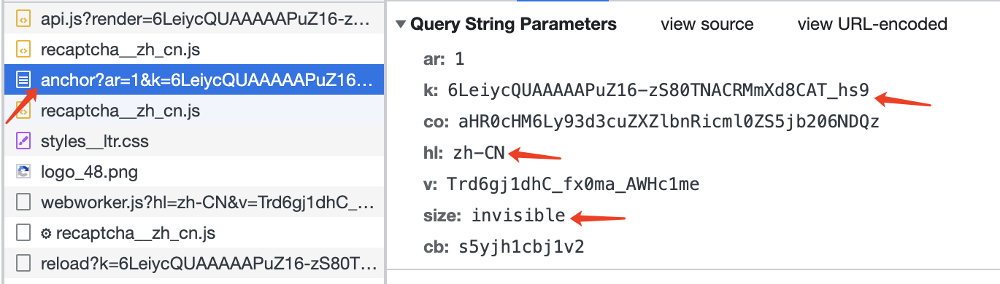
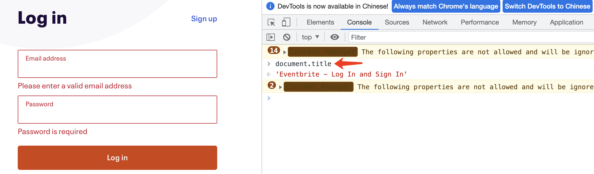
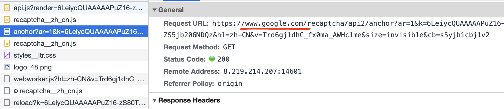
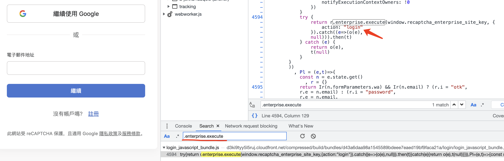
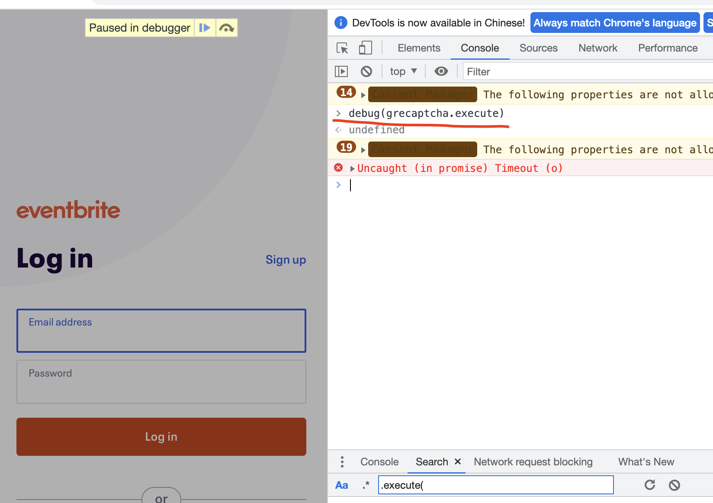
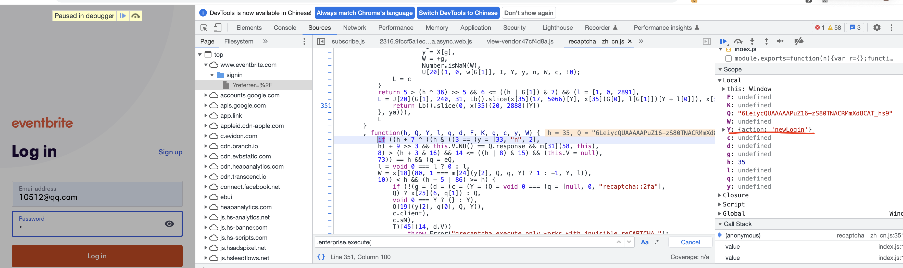
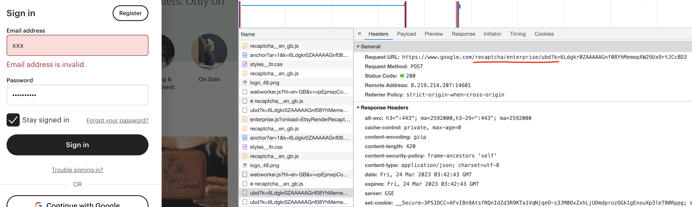

------
[`返回首页`](../README.md)    [`下一页`](cloudflare.md)

## ReCaptcha

### 有问必答

* 如何区分 `v2`、`v3` ？
    * 与其他平台不同的是，我们只分普通版和企业版。`v2`、`v3` 的区别:
        * `v3` 到 `reload` 接口就结束了，`size` 参数一般为 `invisible`（具体请查看网页接口），且需要传 `action`
          参数，请打开 `f12` 搜索 `grecaptcha.execute`，找到该函数的入参对象的 `action` 值，填入 `action` 参数即可。
        * `v2` 通过 `reload` 接口之后还需要请求 `userverify` 接口，`size` 一般为 `normal`
          （具体请查看网页接口），不需要传 `action` 参数。
        * 普通版、企业版接口参数完全相同，唯一不同在于请求路由的不同。

* 如何区分 `普通版`、`企业版` ？
    * 普通版：`anchor` 接口路由： `/recaptcha/api2/anchor`
    * 企业版: `anchor` 接口路由： `/recaptcha/enterprise/anchor`

* 带 `s` 值的企业版（如 `steam`），接口拿到的 token 值，为什么还是不能用？
    * 与你使用的代理质量有关系，请先尝试直接使用你本机 `ip` 或更换代理，如果还是不能用，请联系客服。

### 为什么选择我们

* 通用性: 目前已知网站均能通过验证（包括其他平台过不去的带 `s` 值的企业版，如 `steam`），且接口统一 `v2`、`v3` 。
* 极致的速度: 市面上其他接口都是异步的，需要先创建任务，然后获取任务 id 不停的去轮询获取验证结果，有时耗时会达到 1
  分钟之久，这是难以接受的。而我们的接口使用`纯算法`计算参数，`协议提交`，`同步返回`，`v3 invisible `、`v2 nocaptcha`
  类型平均 `1s` 返回，`v2` 其他图片点击类型最快 `2s`，最慢不会超过 `10s` （这也取决于代理的速度）。
* 高可用: `v3` 分值高，大部分风控强度高的站点（如各种企业版），我们接口生产的 `token` 值，都能通过风控成功获取到目标数据。
* 稳定性: 更新及时（不会超过两小时），更好地支撑您的业务。

### Request URL（POST）:

| 版本                | 接口地址                                                     |
|-------------------|----------------------------------------------------------|
| `通用版（universal）`  | `http://api.nocaptcha.io/api/wanda/recaptcha/universal`  |
| `企业版（enterprise）` | `http://api.nocaptcha.io/api/wanda/recaptcha/enterprise` |
| `steam`           | `http://api.nocaptcha.io/api/wanda/recaptcha/steam`      |

### Request Headers:

| 参数名            | 说明                 | 必须  |
|----------------|--------------------|-----|
| `User-Token`   | `用户密钥, 主页获取`       | `是` |
| `Content-Type` | `application/json` | `是` |
| `Developer-Id` | `开发者 ID, 开发者用户使用, 用户主页邀请链接的字符串(如 xxx/register?c=abcdef, 则 abcdef 为开发者 ID)`           | `否` |

### POST Data（JSON）:

| 参数名              | 类型        | 说明                                                                                                                                                             | 必须  |
|------------------|-----------|----------------------------------------------------------------------------------------------------------------------------------------------------------------|-----|
| `sitekey`        | `String`  | `谷歌验证码对接 key(anchor/reload 接口的 k 值)`                                                                                                                           | `是` |
| `referer`        | `String`  | `触发页面地址`                                                                                                                                                       | `是` |
| `size`           | `String`  | `验证类型(invisible/normal, 只有这两个选择, 具体查看 anchor 接口的 size 值, 必须对应)`                                                                                                | `是` |
| `title`          | `String`  | `触发页面的 title (f12 打开控制台, 输入 document.title)`                                                                                                                   | `是` |
| `action`         | `String`  | `验证码触发页面搜索 grecaptcha.execute(client, {action: action}), 其中的 action 值, v3 才需要`                                                                                 | `否` |
| `hl`             | `String`  | `验证参数, 具体查看 anchor 接口的 size 值, 默认 zh-CN`                                                                                                                       | `否` |
| `internal`       | `Boolean` | `验证流程是否使用国内代理, 默认 true`                                                                                                                                        | `否` |
| `ubd`            | `Boolean` | `验证路由是否是特殊的 ubd 类型, 默认 false`                                                                                                                                  | `否` |

#### 参数查找步骤

* 搜索 `anchor` 接口，获取 `k`、`size`、`hl` 参数, `k` 值为 `sitekey`，填入对应字段即可，`hl` 若是 `zh-CN` 则可以不填，如下图所示：
    * 

* 还是 `anchor` 接口，切换至 `Headers` 选项，查看请求头的 `referer` 参数，填入 `referer` 字段，如下图所示：
    * 

* 切换至 `console` 控制台，输入 `document.title`，将输出值填入 `title` 字段
    * 

* 验证域名 `domain` 参数可传可不传，但是如果是国外站点，且使用 `www.recaptcha.net` 成功率较低，可以尝试 `internal_proxy`
  传 `false`，域名 `domain` 会自动使用 `www.google.com`，网站具体使用的验证域名查找如下所示：
    * 

* 如果按照上述 `v2`、`v3` 区分方式，判断该验证为 `v3`，则还需要查找并填入 `action` 参数，查找方式如下：

    * 方式 1：打开 `f12` ，通用版搜索 `.execute(`，企业版搜索 `.enterprise.execute`，查找代码中的 `action`
      参数，如下图所示，如果没有搜索到，请使用方式 2。
        * 

    * 方式 2：打开 `f12` ，通用版输入 `debug(grecaptcha.execute)`，企业版输入 `debug(grecaptcha.enterprise.execute)`
      ，点击登录等完成验证，等下断点触发，在 `Scope` 中复制 `action` 的值，如下图所示：
        * 
        * 

* 验证路由是否是 `ubd`（目前仅在一个网站的企业版见过这种类型），如果是 `ubd` ，则 `ubd` 参数请填 `true`，否则填 `false` 或不填：

    * 

#### json 示例

```
{
  "referer": "https://www.trustpilot.com/",
  "sitekey": "6Lcxp2UaAAAAABkIC5izuDmTEeXYfgfaoQ9v69Q4",
  "size": "invisible",
  "title": "Login",
  "action": "login",
  "domain": "www.google.com",
  "internal_proxy": false
}
```

### Response Data（JSON）

| 参数名          | 类型        | 说明                            |
|--------------|-----------|-------------------------------|
| `status`     | `Integer` | `调用是否成功, 1 成功, 0 失败, 请使用该值判断` |
| `msg`        | `String`  | `调用结果中文说明`                    |
| `id`         | `String`  | `该次请求 id（唯一, 可用作后续记录查询）`      |
| `data.token` | `String`  | `验证通过返回的 token`               |
| `cost`       | `String`  | `验证耗时（毫秒）`                    |

```
{
  "cost": "1380.01ms",
  "data": {
    "token": "03AFY_a8UL3OTinrQHai6iE4c9l--oZAtVsDsAGBtijmv3QgBWmeOWWvbJvZ_DPT8p2ttvUlr4FmE5gDSTON0f4mPpYqxwPdVYxRbC0nmLuZJ0k9UmOjiK4HgUShuFu4RL7w1hyoFQ1YbUpLtW-KuAqC1KSs4GGBrI3k4Cx4u7e57DQPhVdzzpVGqQjGq9ZnI5YY9546_jRybKrIv2FMLeIkvcOJnCPUTnUREewSn7VO1bCvpdAP3Wj8DoH8jtv-RXij9aypLnFcpLGMTwrJOCE9z2U7As7AzAxcMnVEr9AWyKipKj4t-A2m77uNvHv-f1XhSMNI_Dk4bIYLe5n0N-STCLUc5tFfPc5rtuNQdoTRxdl6ie9gOpzpUyg6dwcA3tEiERya9Tej-6FMpwo4G4F61u8buUAMgCVn-4OoAB9AfH5mjN3GapQf3Yc_mK2u99xErSwEgwuhVsBsMzC22JiVaqHWO8EOzDRso6AMpUmuZw27b3Kl8IhFH1OiIL9WdfMfEXtEDgUFZxL085MxyS_mv5iGDbcxLkXN5PupgT2ieoQ8grbHsbHWF1-9Un0cxF5MVfmIilzbSUtItZ7i2SZcJZlPOG86D1CKby2T7nnprtoVd7hAN4r5yTnQ52f_8oShEKd3n0ArHsfti4TXPuVgafP8jp4uIkgK3YDlF2QvnnuGeEq58dZ91nllOQOBnzc_GiNLvd1h8XrZxexZ2eI_LDueF2p4uSWQBDLXloHV_2lmDf5QsDcUJy46JyhlehLK-MOzLt-BDJ9wVJdtHhY_GT-IymY757nYurqWCLdY7k7ofeIcd51I35Hz88VADyp_EYtRzmd5CIRX_sHx4rlw7Yw1khFG6Ktw-7bRd1nSw1rNZlwFIxvLk4Bgp9WGZS8rqRCKIJgAMAJOzt872i1P9GQ3k6Ee5nn8qTs0CmpckzrvqJLzexQfM69G-A1O0s99PMn0Hr5ruUU_jsj3rtzWu1zXr0soPtArvN2tvTLsRSARIL1G5unTeX7YpURkbVVkmaa08oqpR7eIFVO7I7SZ99jk-DJdXSL5uUs3ZcIe8fzIp_hGtCkSQIrHrB0F5anyER7ZdBH1ynT7aFltOlikAWB_s4lTIYZk7VDUrrwKOSMI3SMHus7BxKZNanhTO34c_9s62t9FRrLaiQfTXy4ZUlCgVAkWt1f_6lrRwj9VZDQRiplJQwIIDpT2jhXrgGLdqIjOBtJ2Doy3Gx4dkpPCuquqhnzyvFCEJdyG-QKaONu4tbFjbUWB7TwIgREUVdrR5k3YN21sVTY2yvNZjc8YVCw-YXIYygZE6OpPJUIhxxXtB55xpxQ2THITBlkIu5QmBtQ4lXi3GBbq_UKB_Lxn5SVjK88yTZ3TD3m8nfH4WDdb4c36Ff4lpGEEIsZtS7U11FqTGu_xv-dgIYN0-t1tK8TKhJLHDG8nRwady2Xiq190yBXI3sDDcumMpCYqf2wE6Hmu2gnLRGlqPYdsnlC0JQMoeUTHhdEBslQb4iPV_0azLHp_kCEZvYZYalmyIibmmI2O9qY9gROUHt7NRLl_-T3mxr7cdRP2kG801i8Y87nY6PVllAs5JCVcRcMu3UXxvgianbXX_VVsuEf3Y-uxoRV7LKHYesm7tsxxcDwUtZiWzjY0PTCMUXgAjWrJDs-w9VUQGGeOWxqebTx-Mg_fTEXvqkmChhFTyBRDF0yQnMx0KaCnOogEK2XxI_ts_M-DWrXFBHUZa9a9a09T-73kpJqlVCcwgQjV-LhyaeQxUIT02_diqL-xM00AWhJmqwnojmmP6cXU34"
  },
  "id": "bc174976-81b2-418e-a6e3-9f7c0bbd41ae",
  "msg": "验证成功",
  "status": 1
}
```

### CURL command

```
curl -L 'http://api.nocaptcha.io/api/wanda/recaptcha/universal' \
 -H 'User-Token: xxx' \
 -H 'Content-Type: application/json' \
 --data-raw '{"sitekey": "6Lcxp2UaAAAAABkIC5izuDmTEeXYfgfaoQ9v69Q4", "referer": "https://www.trustpilot.com/", "size": "invisible", "title": "Login"}' 
```

### 调用示例

#### python

```shell
pip install -U pynocaptcha -i https://pypi.python.org/simple
```

```python
from pynocaptcha import ReCaptchaUniversalCracker, ReCaptchaEnterpriseCracker

cracker = ReCaptchaUniversalCracker(
    user_token="xxx",
    sitekey="6Le6xNgUAAAAAHDXXUgcrCYACaq_K-iUTa-BIm4h",
    referer="https://visa-fr.tlscontact.com/gb/lon/login.php",
    size="invisible",
    action="login_form",
    title="Login",
    debug=True,
)
ret = cracker.crack()
print(ret)

cracker = ReCaptchaEnterpriseCracker(
    user_token="xxx",
    sitekey="6LcTV7IcAAAAAI1CwwRBm58wKn1n6vwyV1QFaoxr",
    referer="https://login.coinbase.com/",
    size="invisible",
    debug=True,
)

ret = cracker.crack()
print(ret)
```
